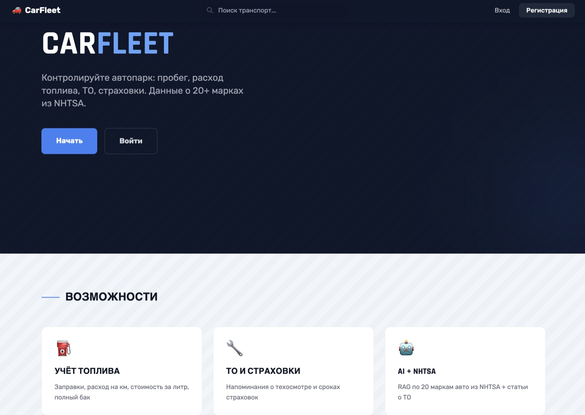
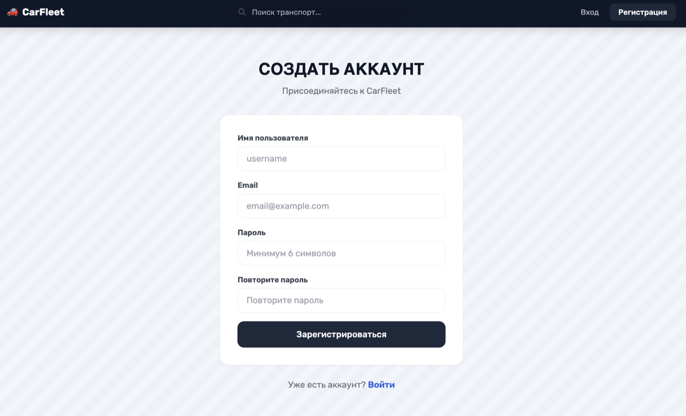
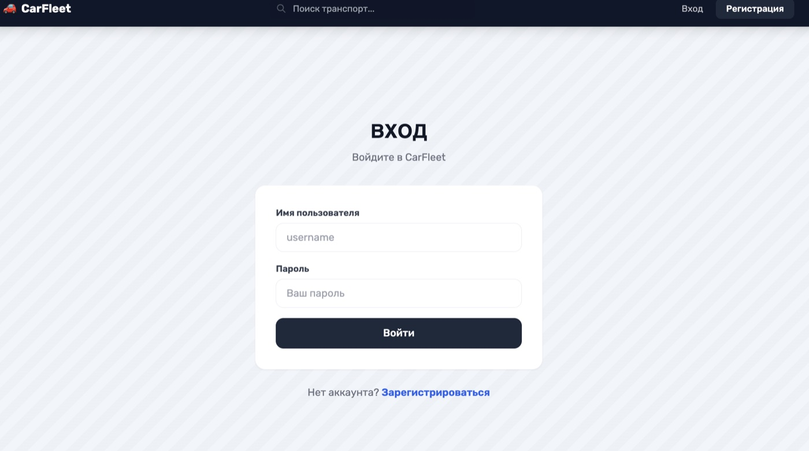
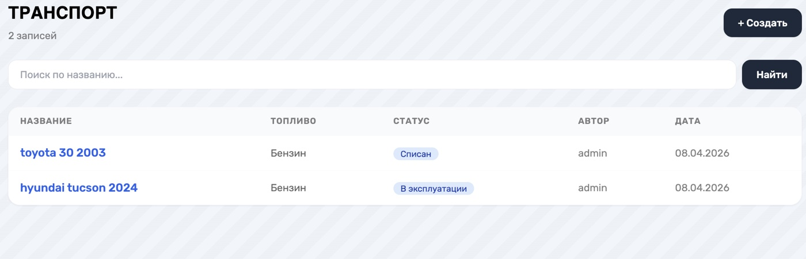
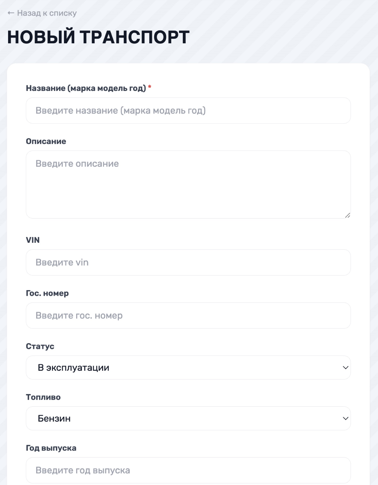
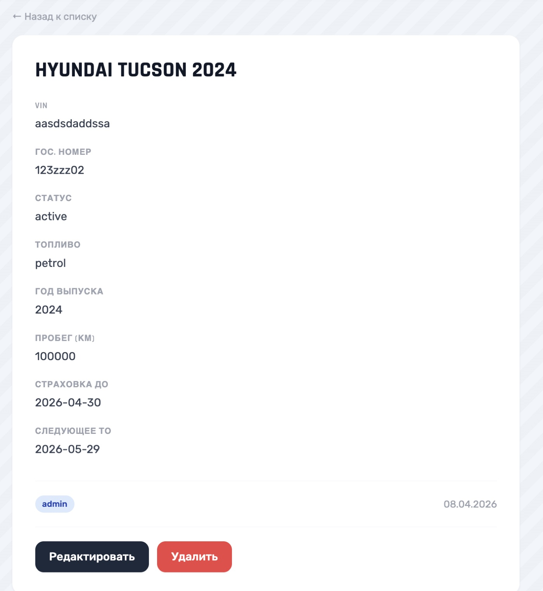
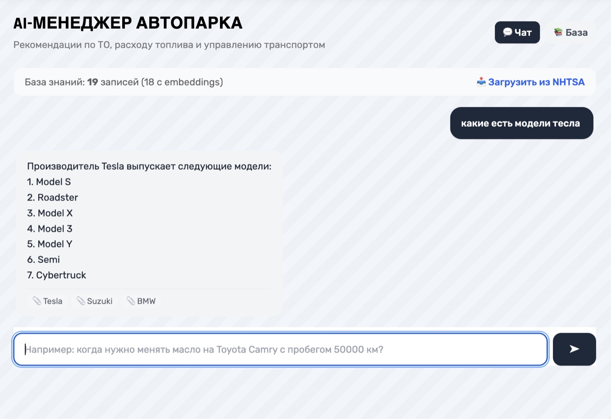
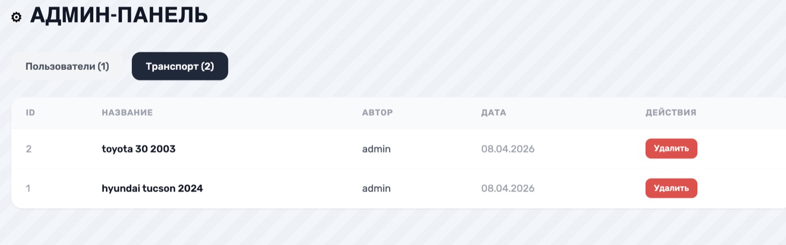
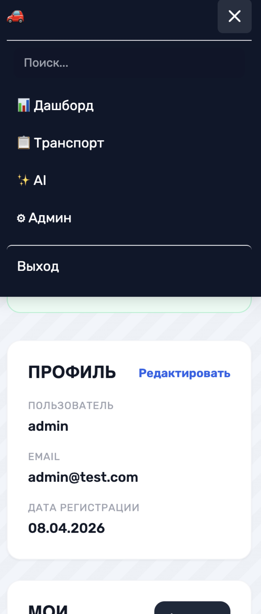

# CarFleet

Управление автопарком с учётом топлива и ТО. Django 5 + React 18 + OpenAI RAG.

**Данные:** NHTSA API — данные по 20 маркам автомобилей

### Запуск

### Что внутри
JWT-авторизация • Роли (user/admin) • CRUD транспорт • Учёт топлива • ТО и страховки • Дашборд • AI с RAG • База знаний • Админ-панель • Мобильная версия

### Скриншоты

#### Главная

#### Регистрация и вход

| Регистрация | Вход |
|:-----------:|:----:|
|  |  |

#### Автопарк

| Список | Создание |
|:------:|:--------:|
|  |  |

#### Детальная страница

#### AI-ассистент с RAG

#### Админ-панель

#### Мобильная версия

### API
`POST /api/auth/login/` • `GET/POST /api/items/` • `POST /api/ai/generate/` • `POST /api/ai/fetch-data/` • `GET /api/ai/knowledge/`
