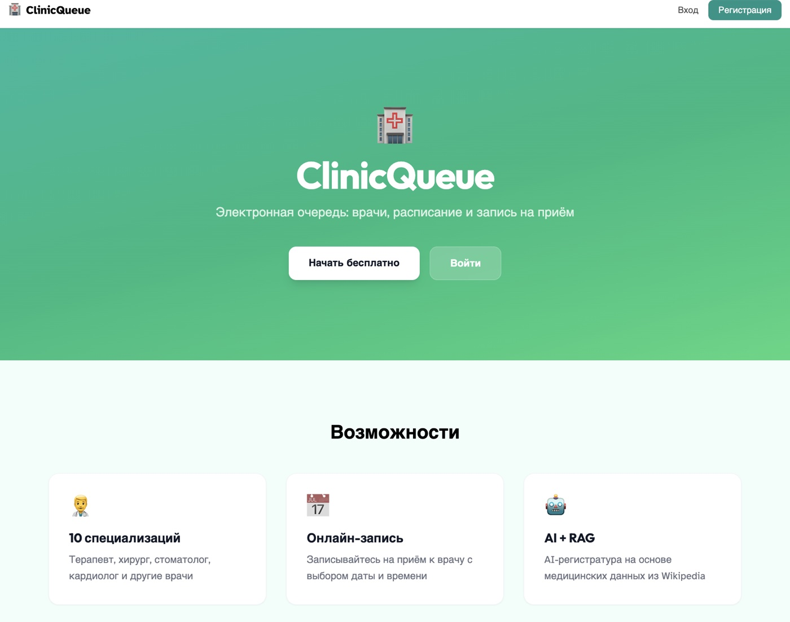
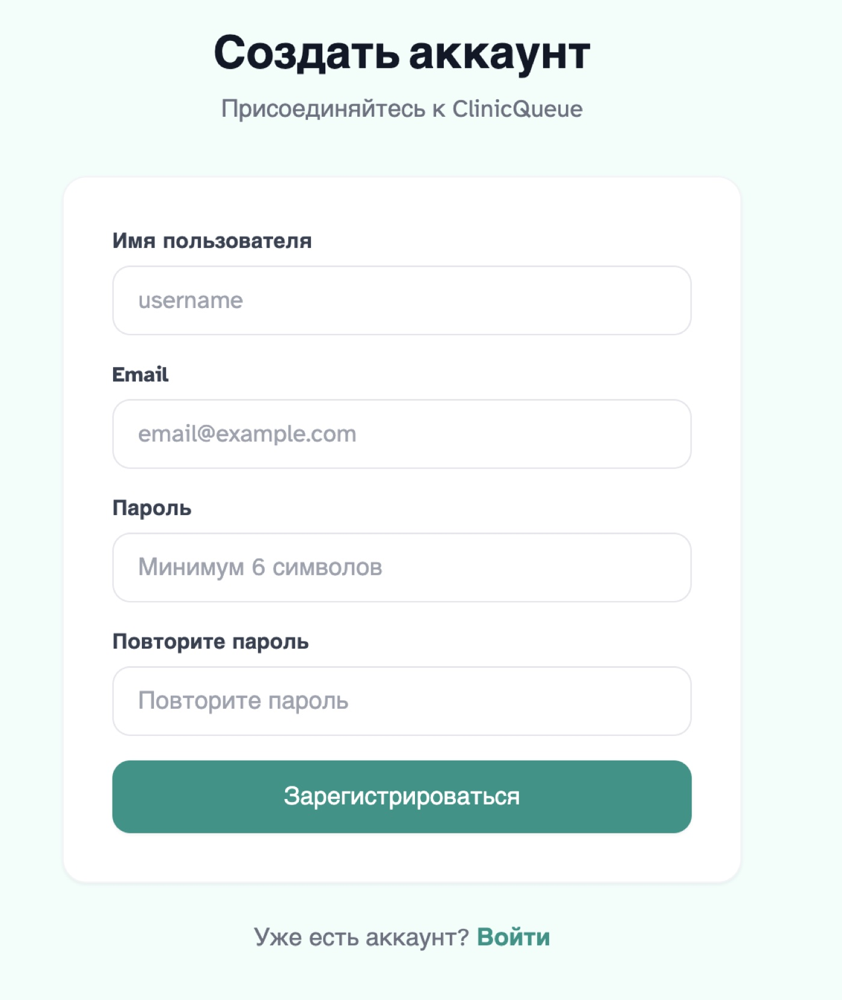
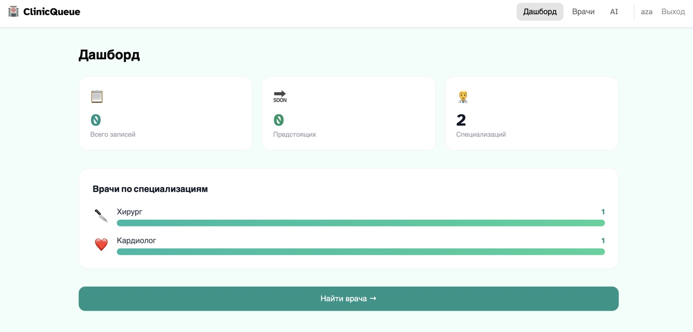
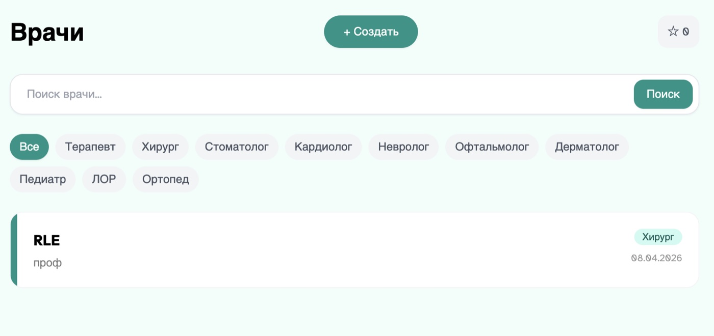
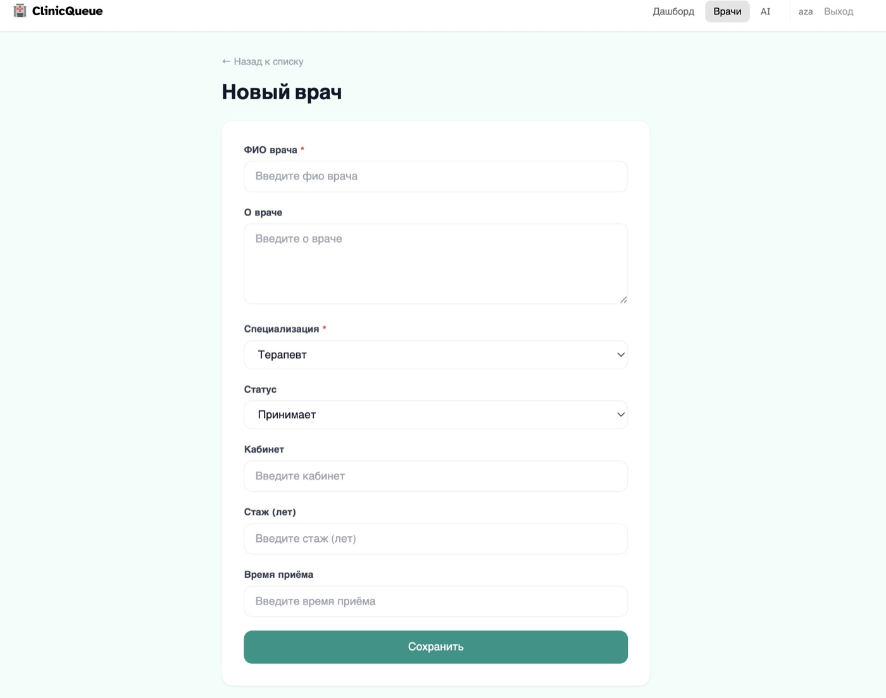
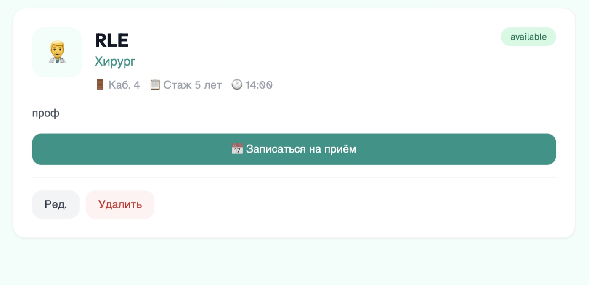
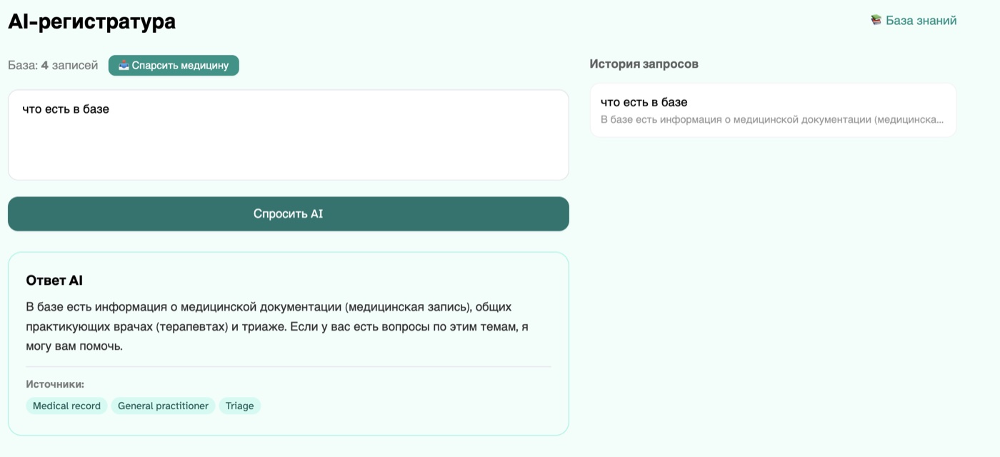
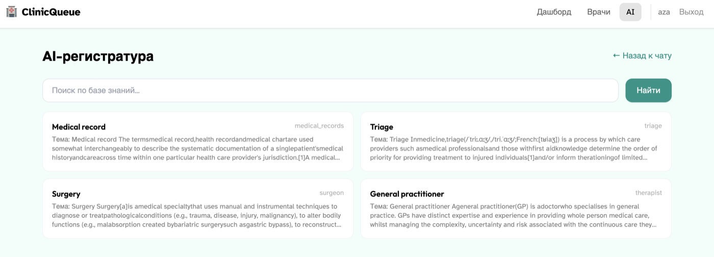
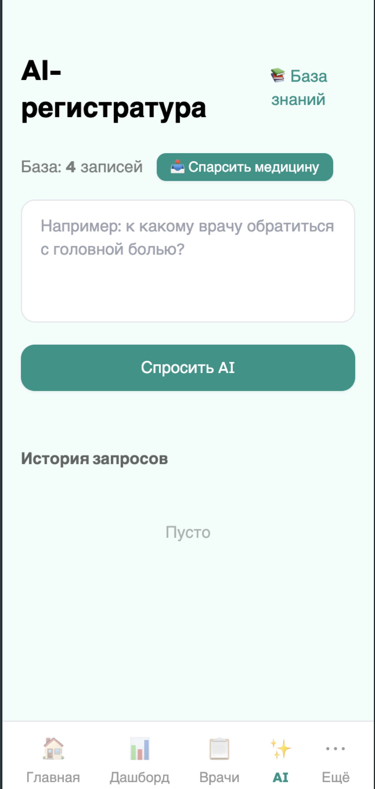

# ClinicQueue — Электронная очередь в клинику с записью на приём

## Описание

Электронная очередь в клинику с записью на приём. Полнофункциональное SPA с REST API, AI-модулем и RAG для ответов на основе реальных данных.

## Стек

| Компонент | Технология |
|-----------|------------|
| Backend | Django 5 + DRF |
| Auth | SimpleJWT |
| Frontend | React 18 + Vite + Tailwind |
| AI | OpenAI GPT-3.5 + RAG |
| Embeddings | text-embedding-3-small |
| Данные | Парсинг Wikipedia — 12 медицинских специализаций (BeautifulSoup) |

## Возможности

- Регистрация / авторизация (JWT)
- Роли: User, Admin
- CRUD для сущности: врач
- Запись на приём с выбором даты и времени
- Дашборд с графиками по специализациям
- Избранные врачи (★ закладки)
- AI-ассистент с RAG
- Bottom-навигация на мобильном
- Адаптивный дизайн

## Скриншоты

### Главная


### Регистрация


### Дашборд


### Врачи

| Список врачей | Добавление врача |
|:-------------:|:----------------:|
|  |  |

### Детальная страница врача (запись на приём)


### AI-ассистент с RAG

| Ответ AI | База знаний |
|:--------:|:-----------:|
|  |  |

### Мобильная версия


## Запуск

```bash
cd backend && python manage.py runserver
cd frontend && npm run dev
```
