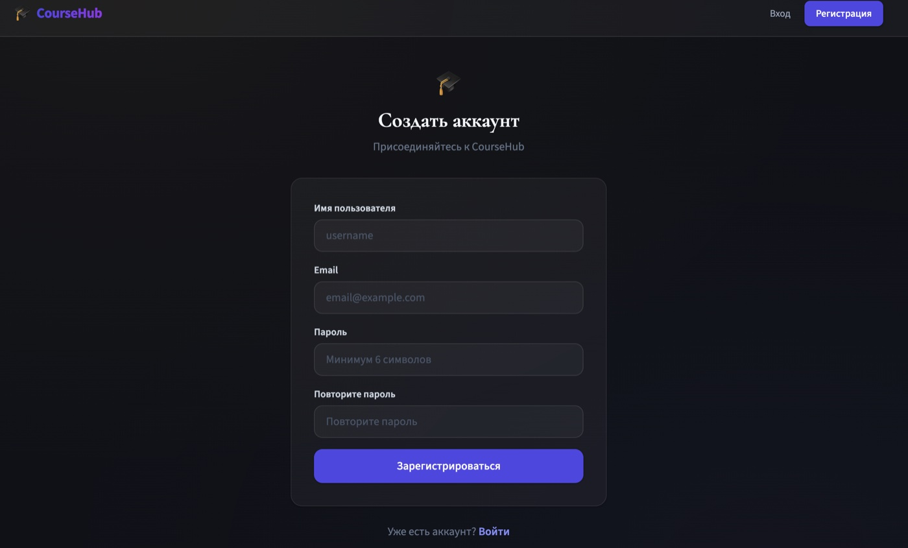
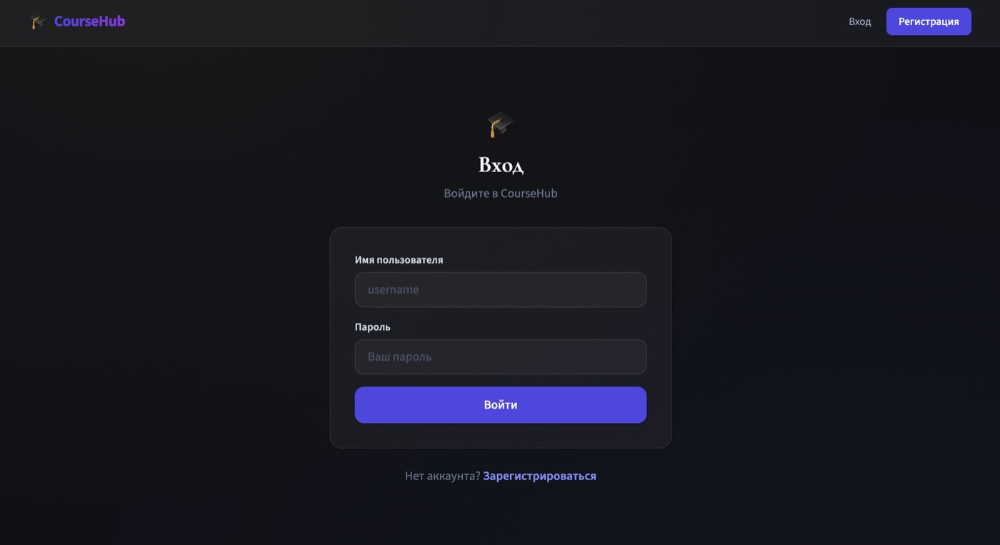
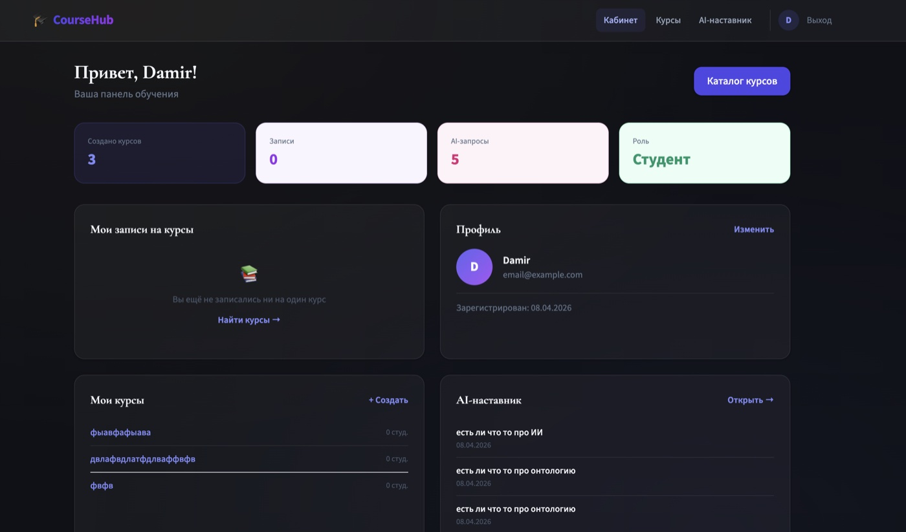
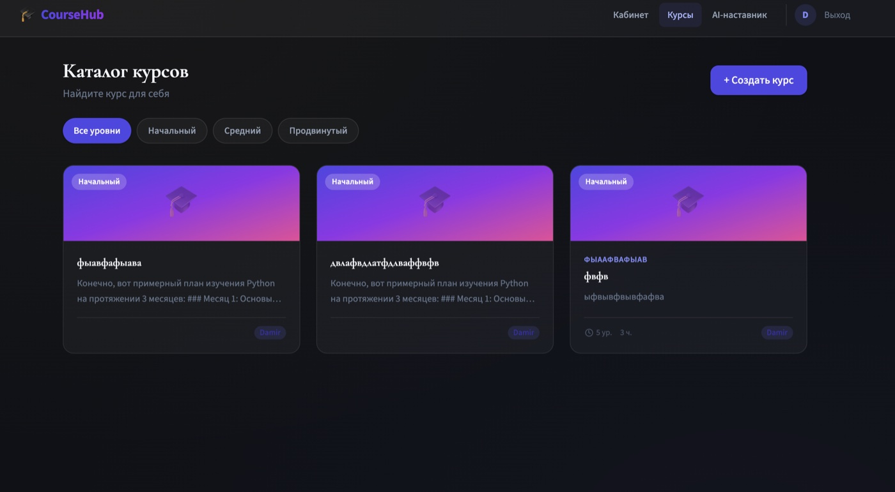
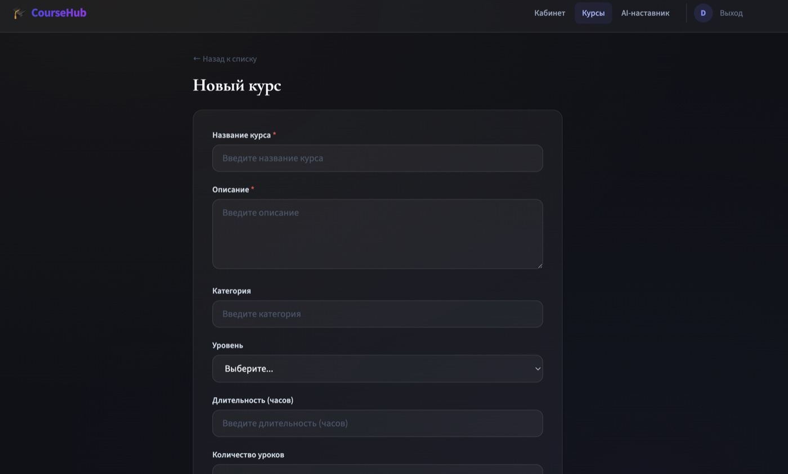
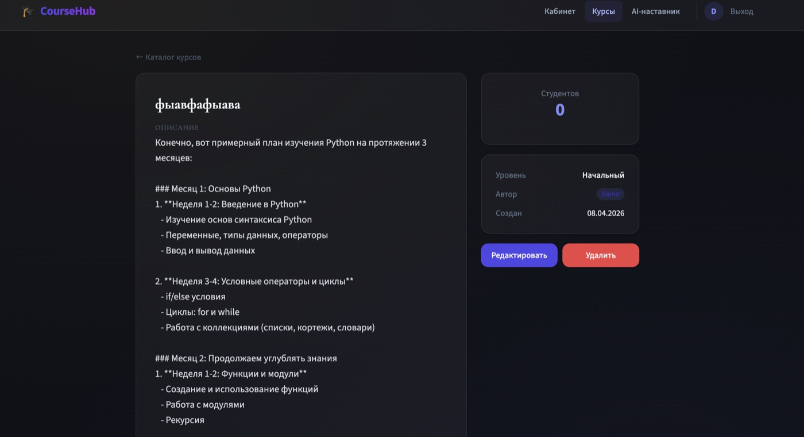
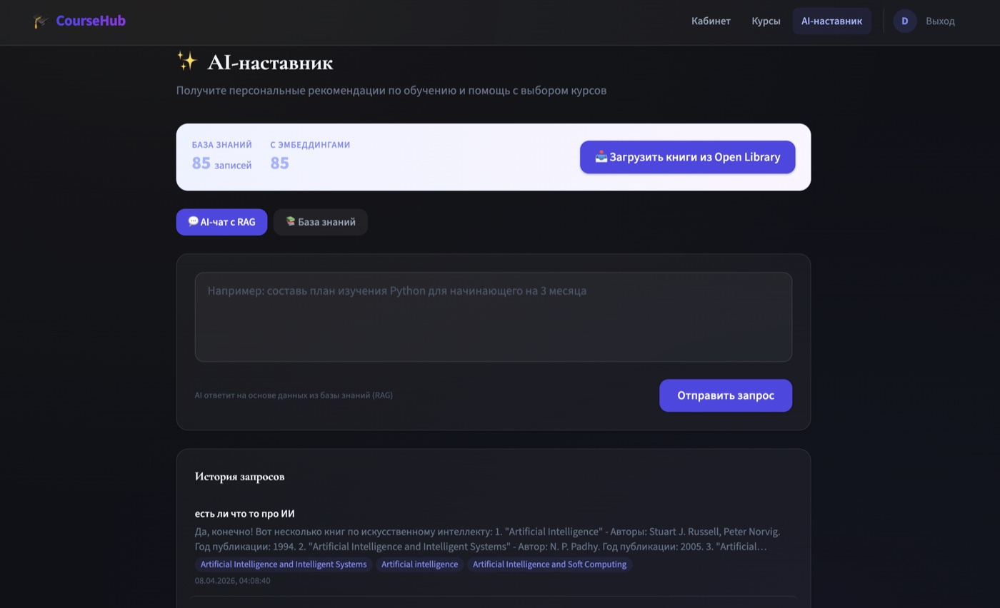
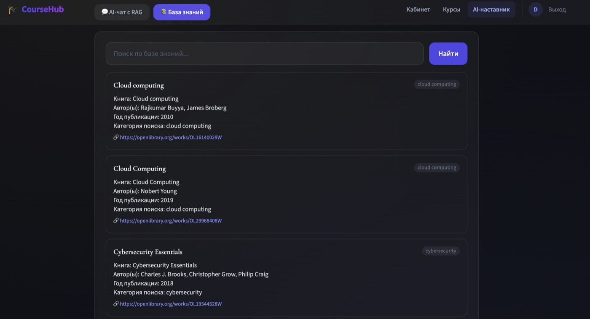
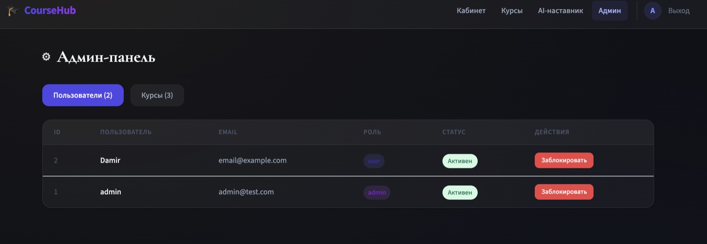
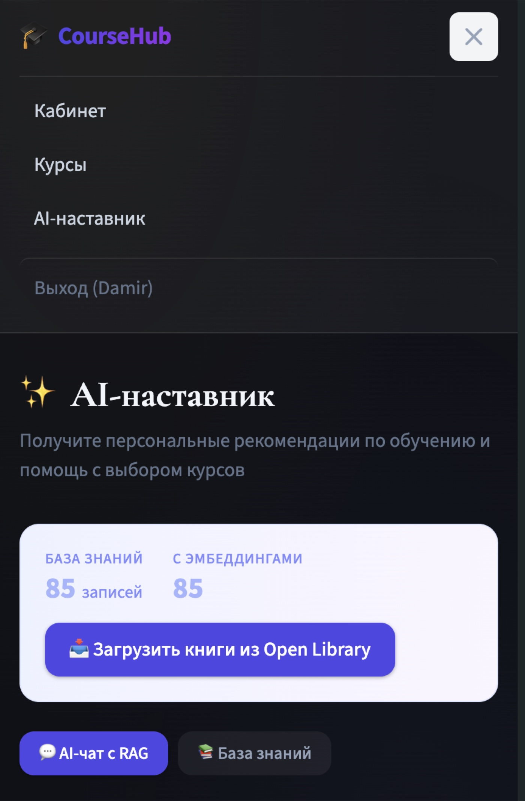

# CourseHub

   

**Образовательная платформа для создания и прохождения курсов с AI-ментором на базе реальных книг.**

---

### Ключевые особенности

| Функция | Описание |
|---------|----------|
| Auth | JWT (access + refresh) |
| Роли | User, Admin |
| Сущность | Курс (CRUD) |
| AI | GPT-3.5 + RAG с embeddings |
| Данные | Open Library API — книги по 20 направлениям |
| UI | Адаптивный дизайн (desktop + mobile) |

### RAG Pipeline

```
Запрос → Embedding (text-embedding-3-small) → Cosine Search → Top-3 контекст → LLM → Ответ + Источники
```

---

## Скриншоты

### Главная страница


### Регистрация и вход

| Регистрация | Вход |
|:-----------:|:----:|
|  |  |

### Личный кабинет (Дашборд)


### Курсы

| Список курсов | Создание курса |
|:-------------:|:--------------:|
|  |  |

### Детальная страница курса


### AI-ассистент с RAG

| База знаний загружена | База знаний (список) |
|:---------------------:|:--------------------:|
|  |  |

### Админ-панель


### Мобильная версия


---

## Установка и запуск

```bash
# Первоначальная настройка

# Backend (терминал 1)
cd backend
source /path/to/shared_venv/bin/activate
python manage.py runserver

# Frontend (терминал 2)
cd frontend
npm run dev
```

Открыть http://localhost:5173  
Админ: `admin` / `admin123`

## API Endpoints

| Метод | Эндпоинт | Описание |
|-------|----------|----------|
| POST | `/api/auth/register/` | Регистрация |
| POST | `/api/auth/login/` | Авторизация (JWT) |
| GET | `/api/auth/profile/` | Профиль пользователя |
| GET/POST | `/api/items/` | Список / создание курсов |
| GET/PUT/DELETE | `/api/items/:id/` | Курс (CRUD) |
| GET | `/api/items/my-stats/` | Статистика |
| POST | `/api/ai/generate/` | AI-генерация (RAG) |
| POST | `/api/ai/fetch-data/` | Загрузка книг из Open Library |
| GET | `/api/ai/knowledge/` | Просмотр базы знаний |
| GET | `/api/ai/knowledge/stats/` | Статистика базы знаний |
