# EduTest

## Что это?

Платформа тестирования с автоматической проверкой. SPA с REST API бэкендом и AI-модулем.

## Зачем?

Демонстрация полного цикла: frontend + backend + AI + реальные данные. AI использует RAG — ищет в базе знаний через embeddings и отвечает на основе найденного.

## Откуда данные?

Open Trivia DB — 90+ вопросов из 9 категорий

Данные загружаются кнопкой на странице AI, сохраняются с embedding-вектором и используются для семантического поиска.

## Как запустить?

```bash
cd backend && python manage.py runserver  # терминал 1
cd frontend && npm run dev                # терминал 2
```

Админ: `admin` / `admin123`

## Что можно делать?

1. Зарегистрироваться и войти
2. Создать тест с вопросами
3. Пройти тест (режим квиза с прогресс-баром)
4. Посмотреть результаты и средний балл
5. AI → загрузить данные → задать вопрос → получить ответ с источниками
6. Избранные тесты (★ закладки)
7. Админка — управление пользователями

## Скриншоты

### Главная
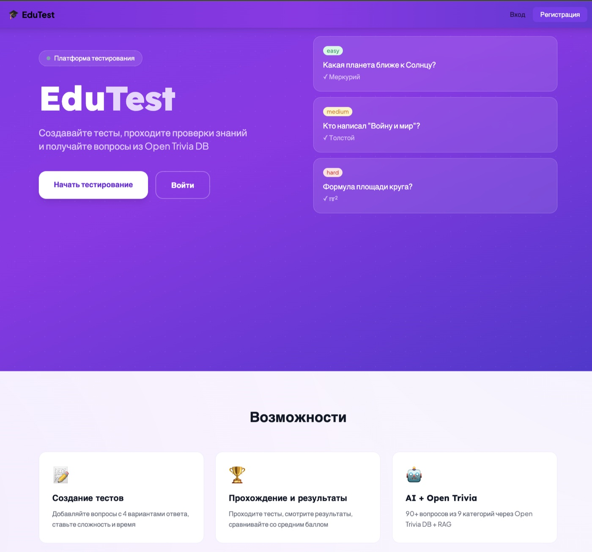

### Вход
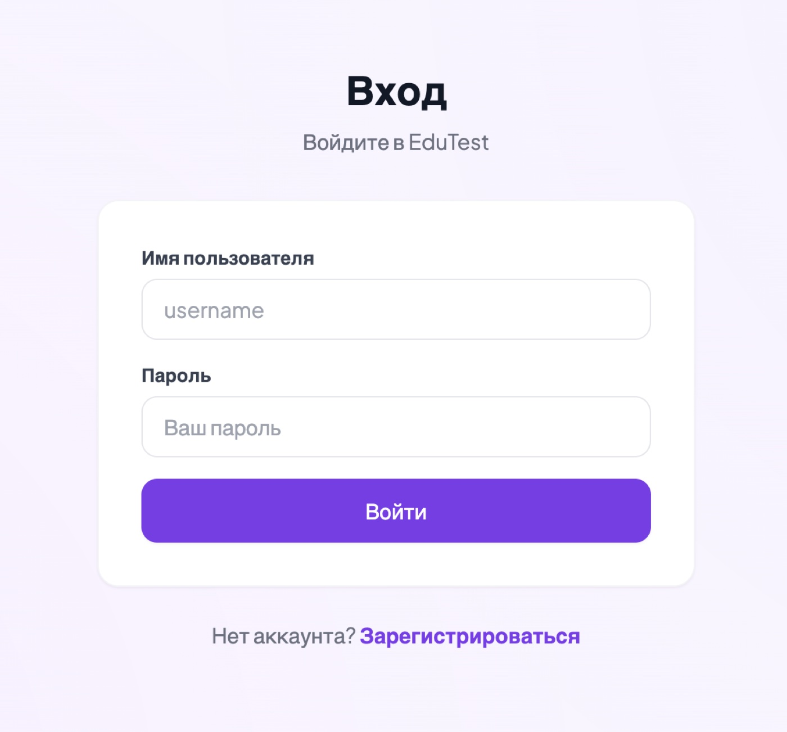

### Дашборд с графиками
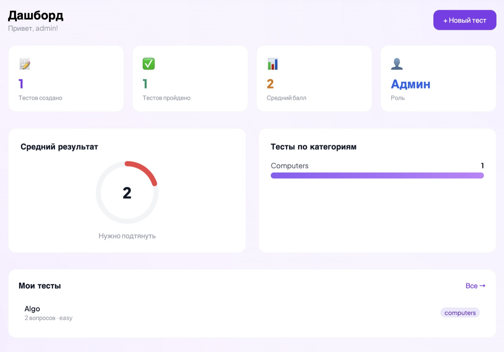

### Тесты

| Список тестов | Создание теста |
|:-------------:|:--------------:|
| 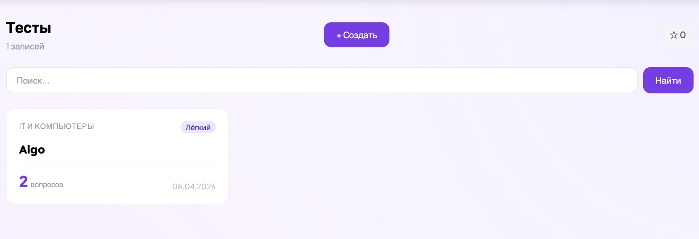 | 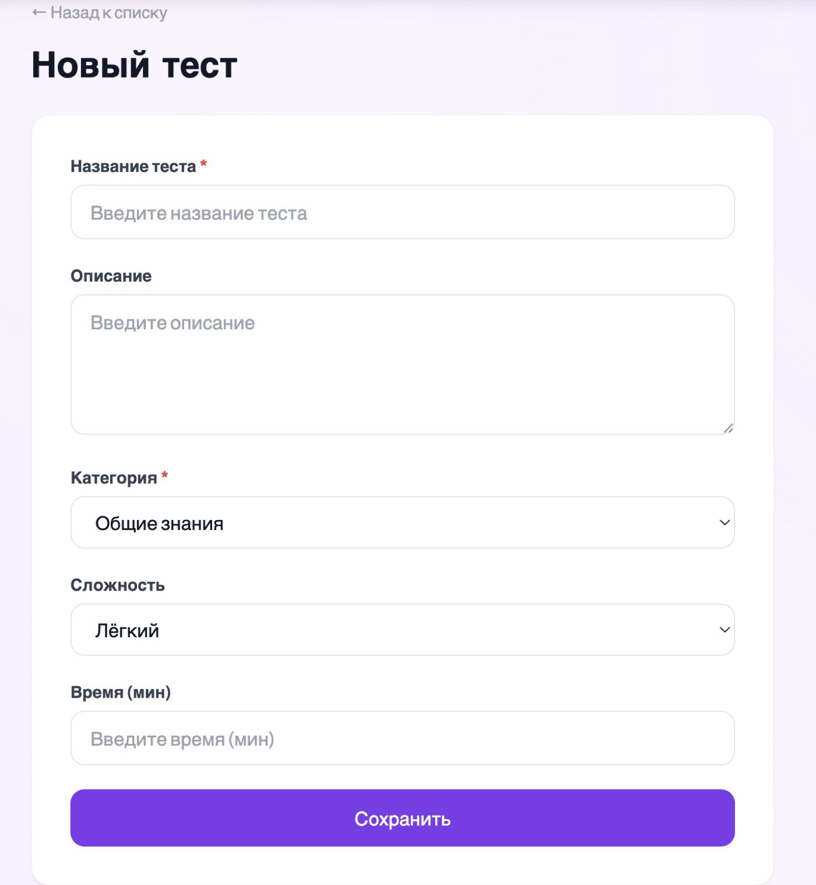 |

### Детальная страница теста
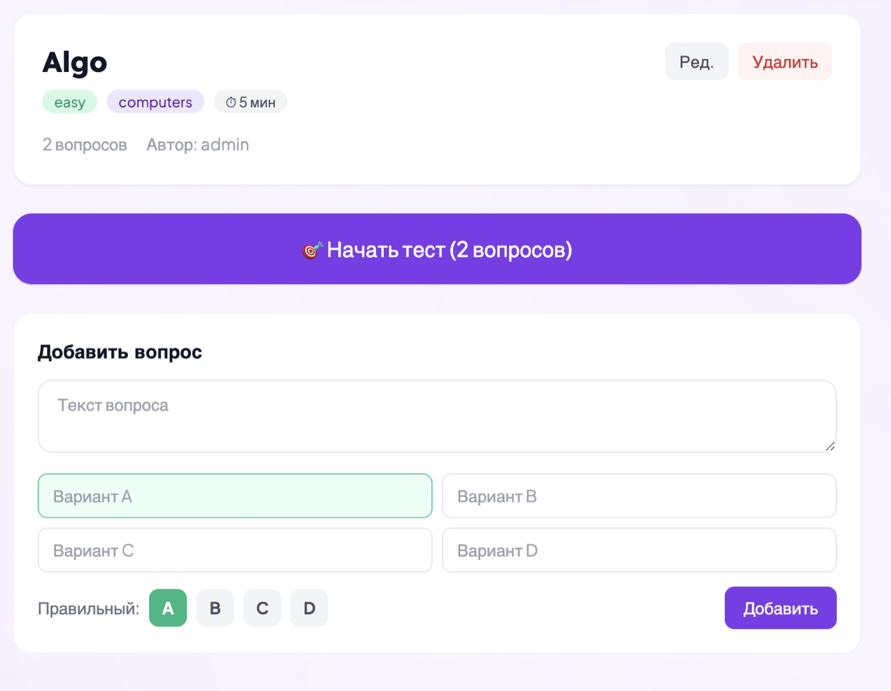

### Прохождение теста

| Квиз | Результат |
|:----:|:---------:|
| 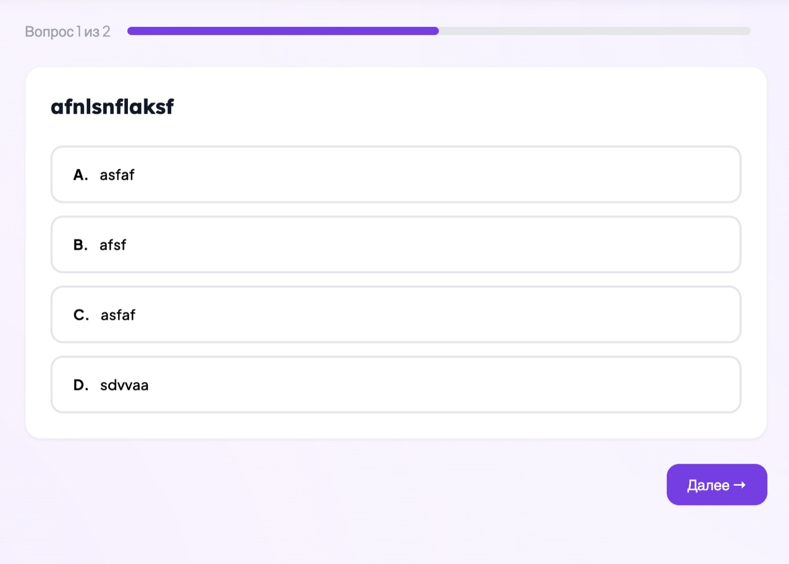 | 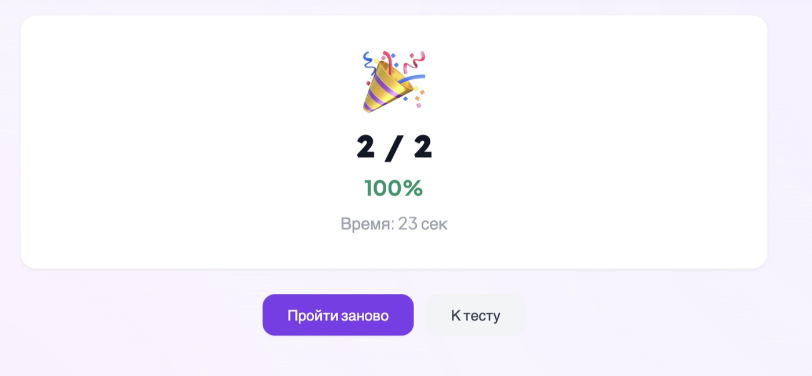 |

### AI-ассистент с RAG

| Ответ AI | База знаний |
|:--------:|:-----------:|
| 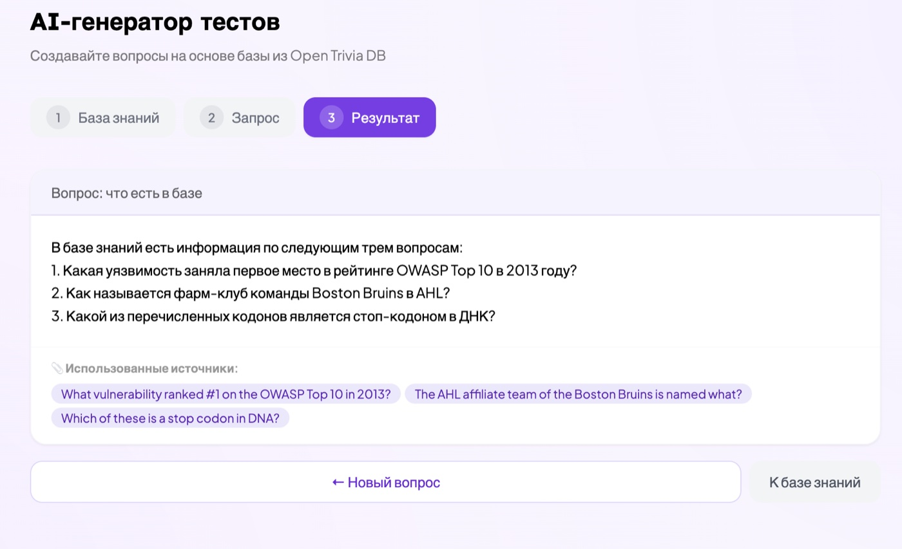 | 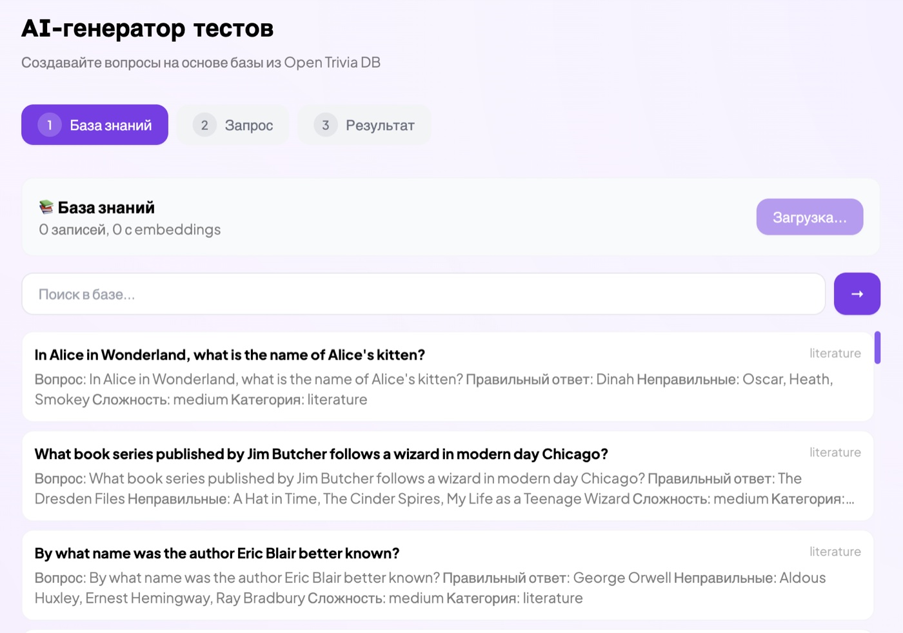 |

### Админ-панель
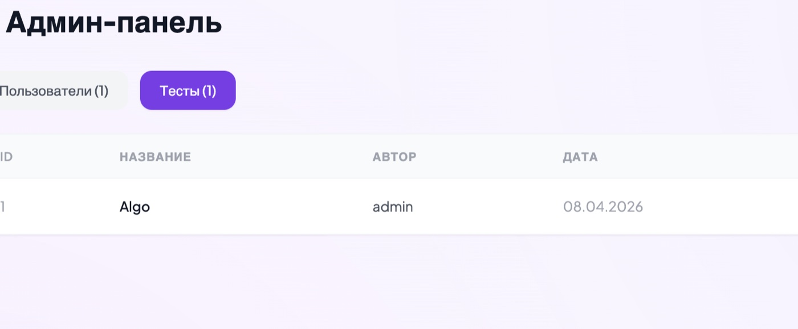

### Мобильная версия
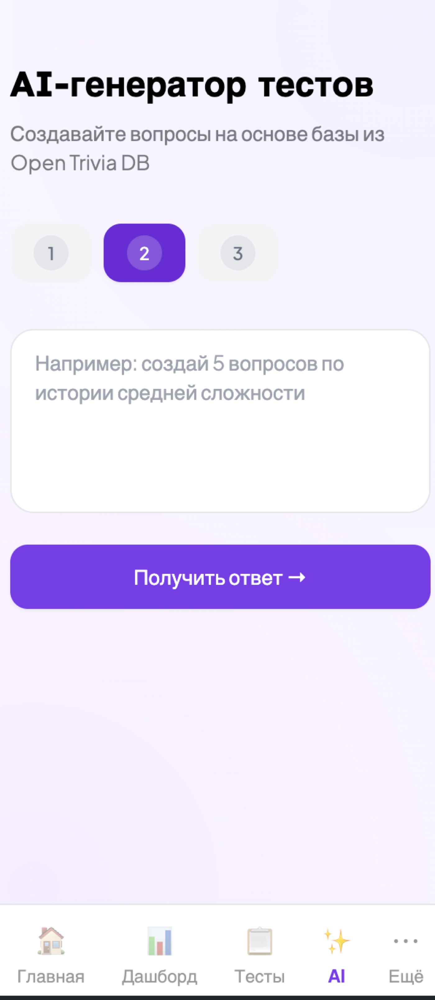

## Стек

Django 5 • DRF • SimpleJWT • React 18 • Vite • Tailwind CSS • OpenAI • numpy
