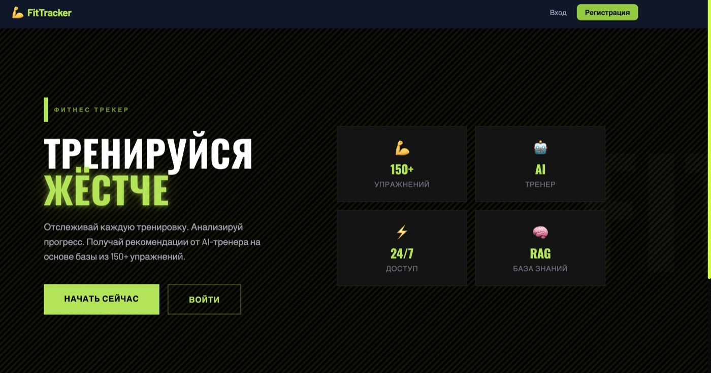
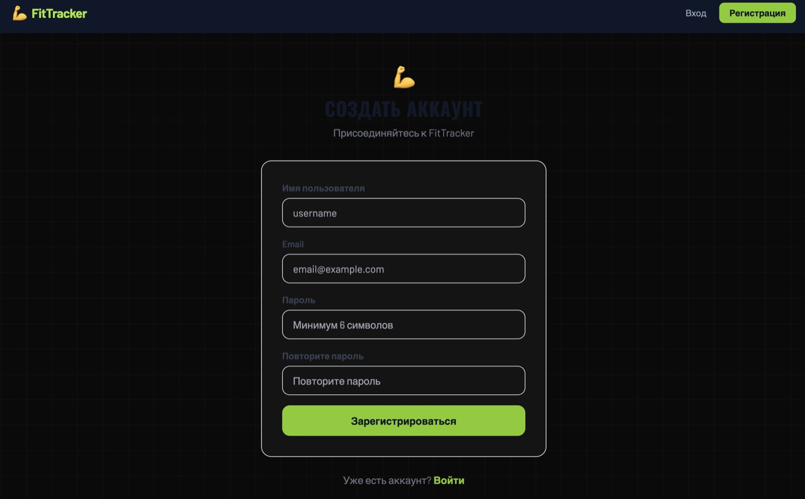
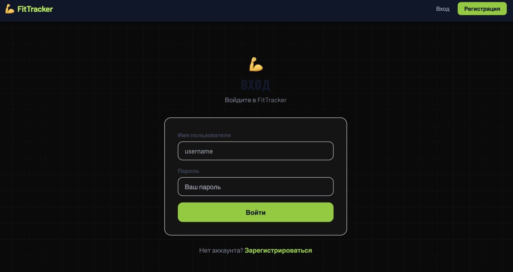
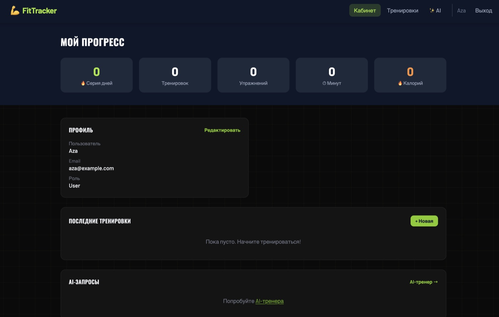
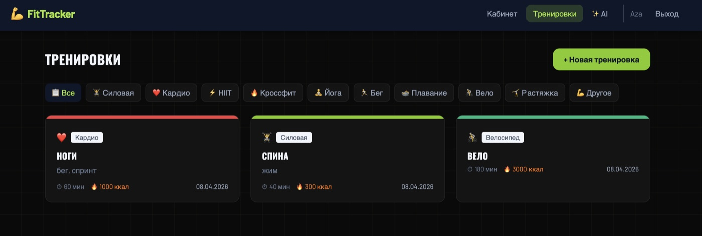
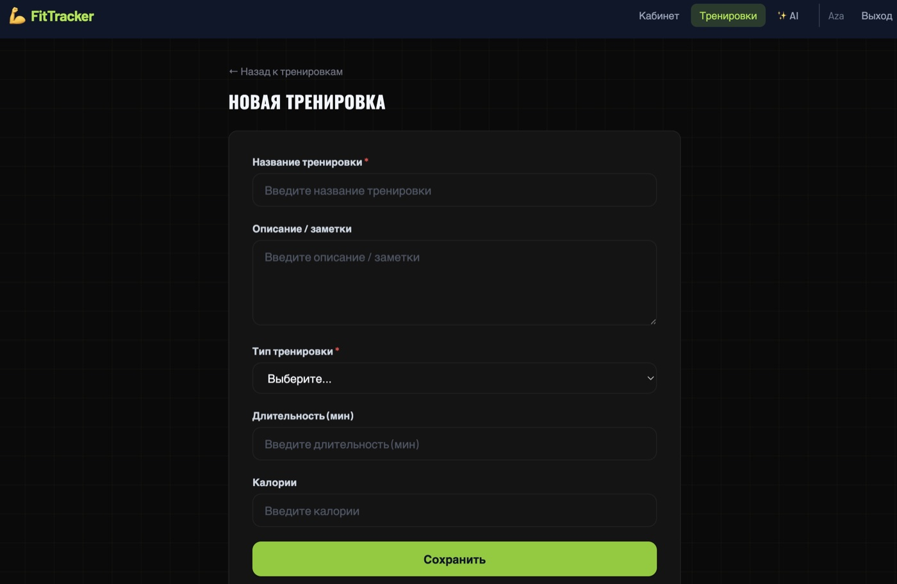
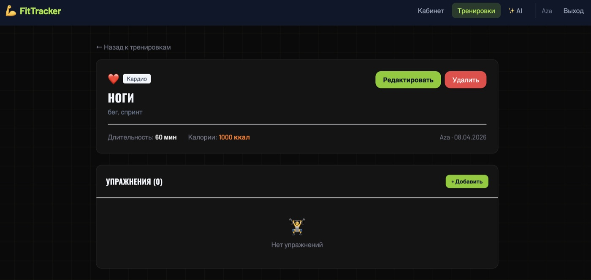
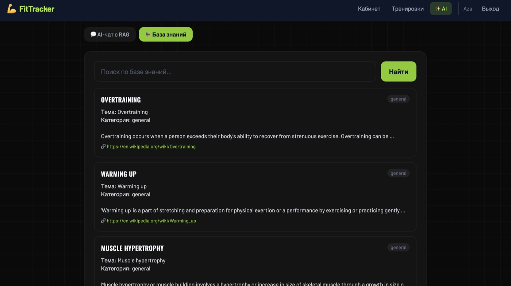
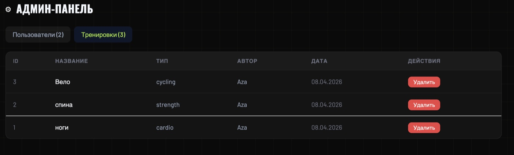
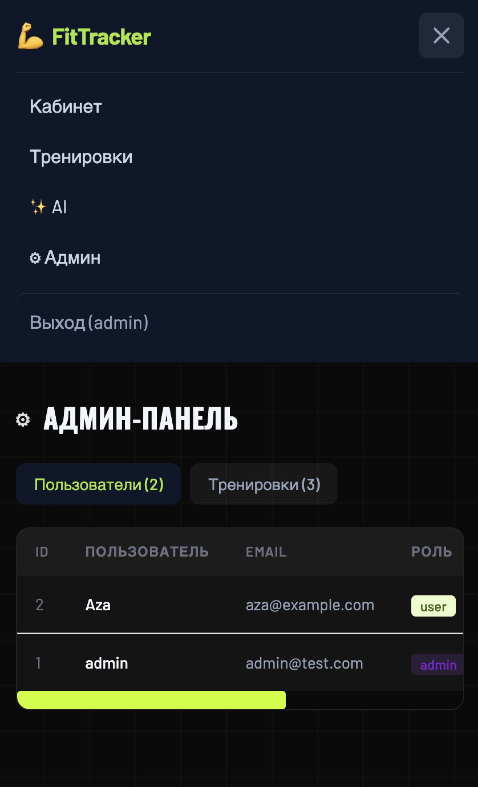

# FitTracker — Дневник тренировок с отслеживанием упражнений и прогресса

## Описание

Дневник тренировок с отслеживанием упражнений и прогресса. Полнофункциональное SPA с REST API, AI-модулем и RAG для ответов на основе реальных данных.

## Стек

| Компонент | Технология |
|-----------|------------|
| Backend | Django 5 + DRF |
| Auth | SimpleJWT |
| Frontend | React 18 + Vite + Tailwind |
| AI | OpenAI GPT-3.5 + RAG |
| Embeddings | text-embedding-3-small |
| Данные | Wger API (wger.de) — 150+ упражнений, мышцы, оборудование |

## Возможности

- Регистрация / авторизация (JWT)
- Роли: User, Admin
- CRUD для сущности: тренировка
- Дашборд со статистикой
- AI-ассистент с RAG (поиск по embeddings → контекст → ответ)
- База знаний (загрузка, поиск, просмотр)
- Админ-панель (пользователи, модерация)
- Адаптивный дизайн

## Скриншоты

| Страница | Превью |
|----------|--------|
| Главная |  |
| Регистрация| |
| Вход| 
| Дашборд |  |
| Список |  |
| Создание |  |
| Детальная |  |
| AI |  |
| База знаний |  |
| Админ |  |
| Мобильная |  |

## Запуск

```bash
cd backend && python manage.py runserver  # API
cd frontend && npm run dev                # UI → http://localhost:5173
```
