# FlashCards

## Что это?

Система флеш-карточек для запоминания терминов. SPA с REST API бэкендом и AI-модулем.

## Зачем?

Демонстрация полного цикла: frontend + backend + AI + реальные данные. AI использует RAG — ищет в базе знаний через embeddings и отвечает на основе найденного.

## Откуда данные?

Парсинг Wikipedia — глоссарии из 6 научных областей (BeautifulSoup)

Данные загружаются кнопкой на странице AI, сохраняются с embedding-вектором и используются для семантического поиска.

## Как запустить?

```bash
cd backend && python manage.py runserver  # терминал 1
cd frontend && npm run dev                # терминал 2
```

Админ: `admin` / `admin123`

## Что можно делать?

1. Зарегистрироваться и войти
2. Создать колода карточек
3. Посмотреть список и дашборд
4. AI → загрузить данные → задать вопрос → получить ответ с источниками
5. Админка — управление пользователями

## Скриншоты

| | |
|---|---|
| 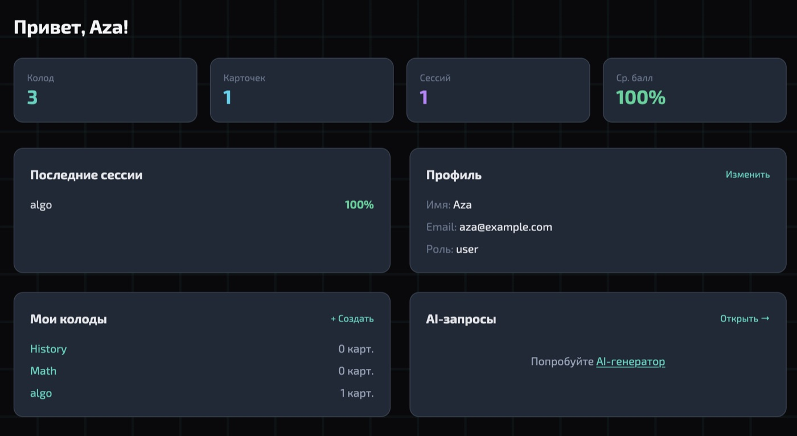 | 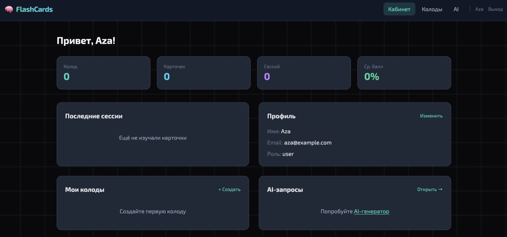 |
| 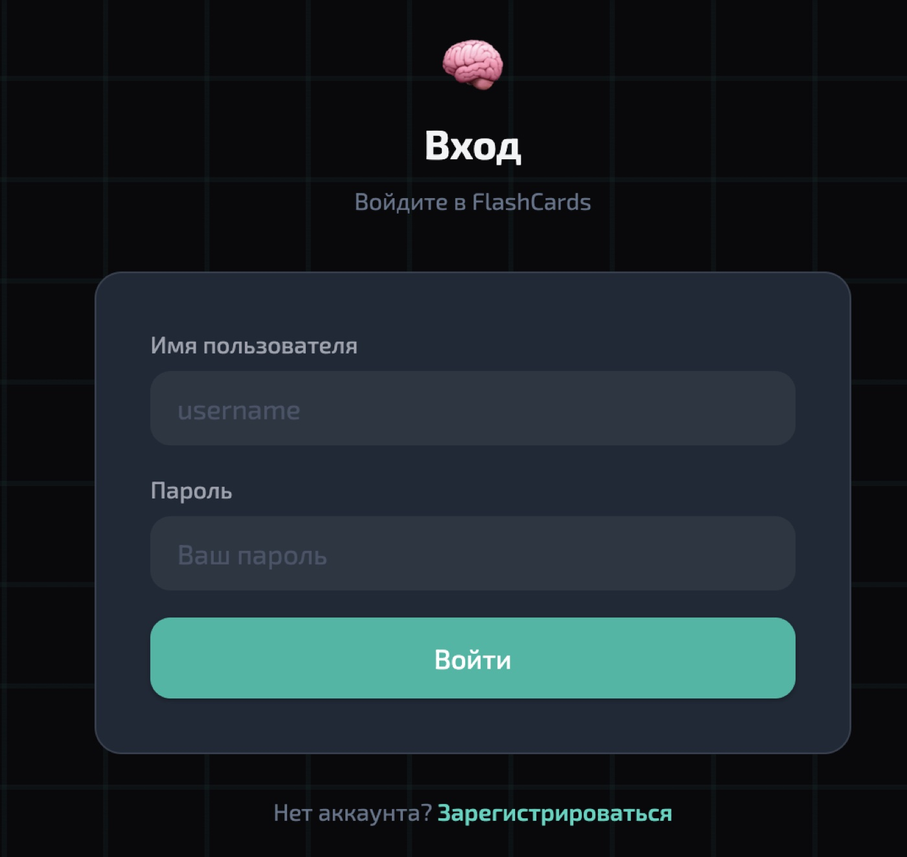| 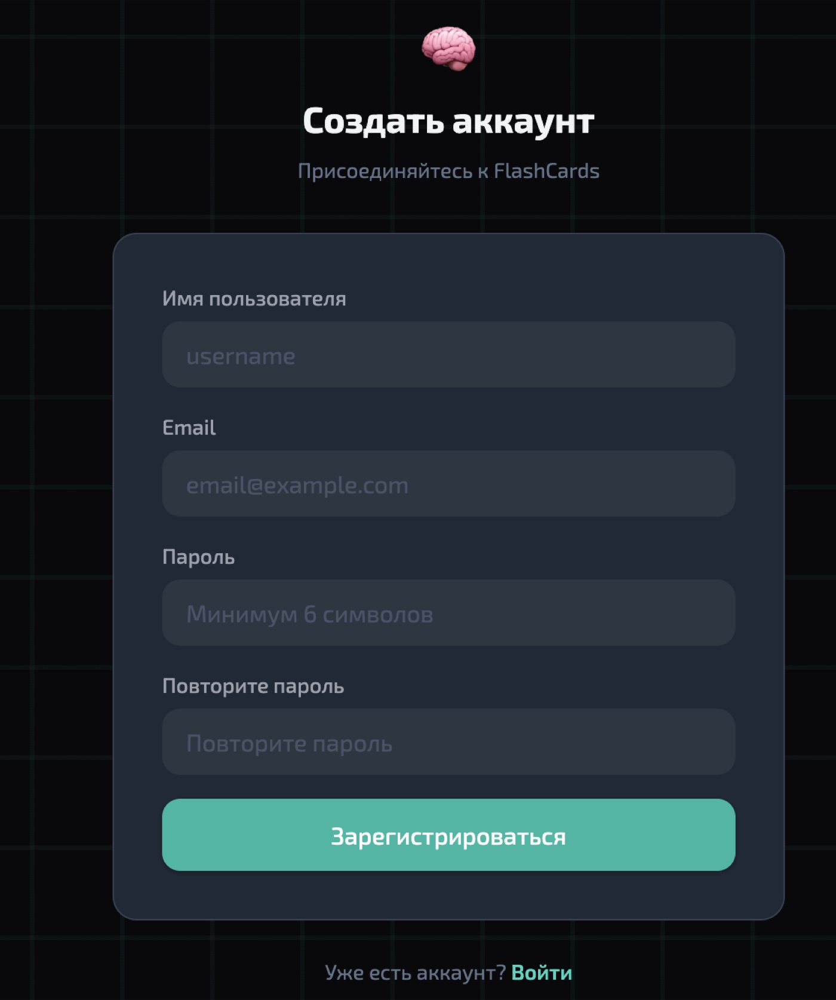 |
| ! [детали](docs/screenshots/07_detail.jpg)| 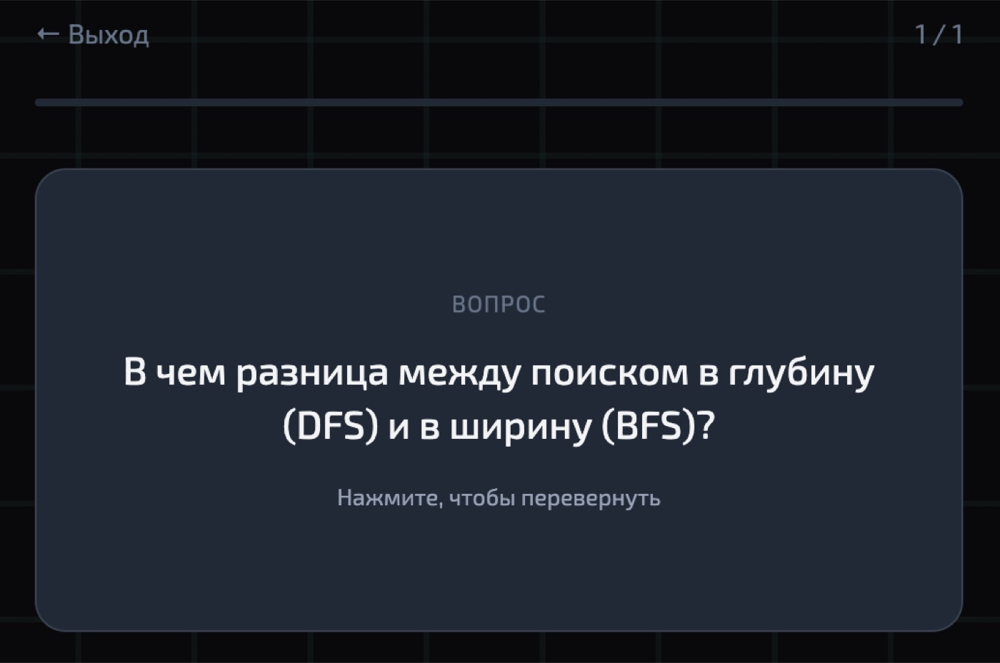|
| 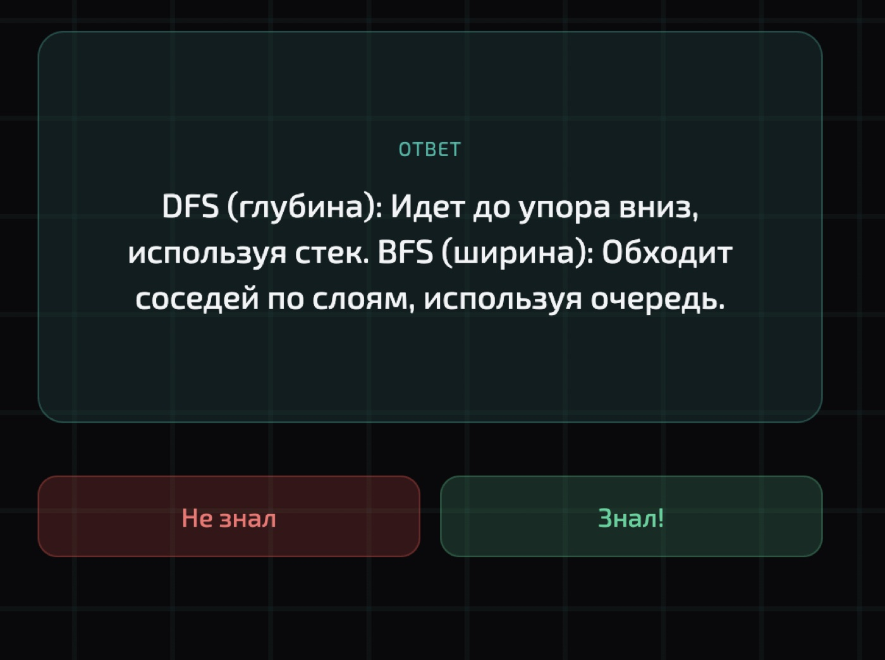| 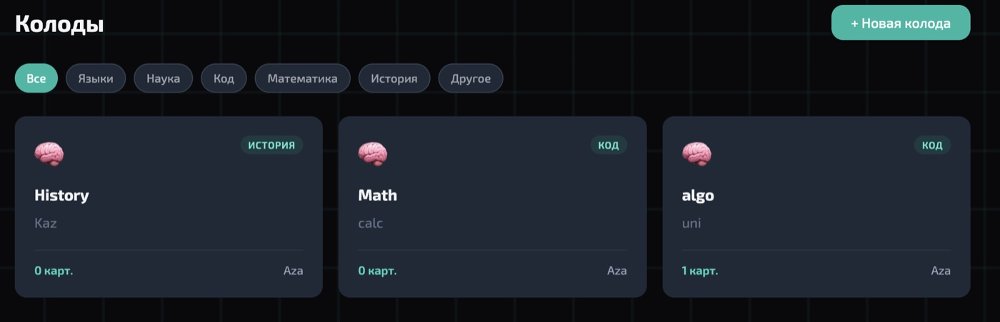|
| 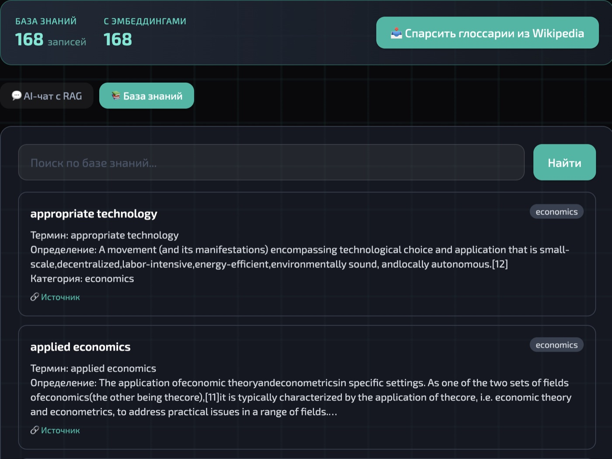 | 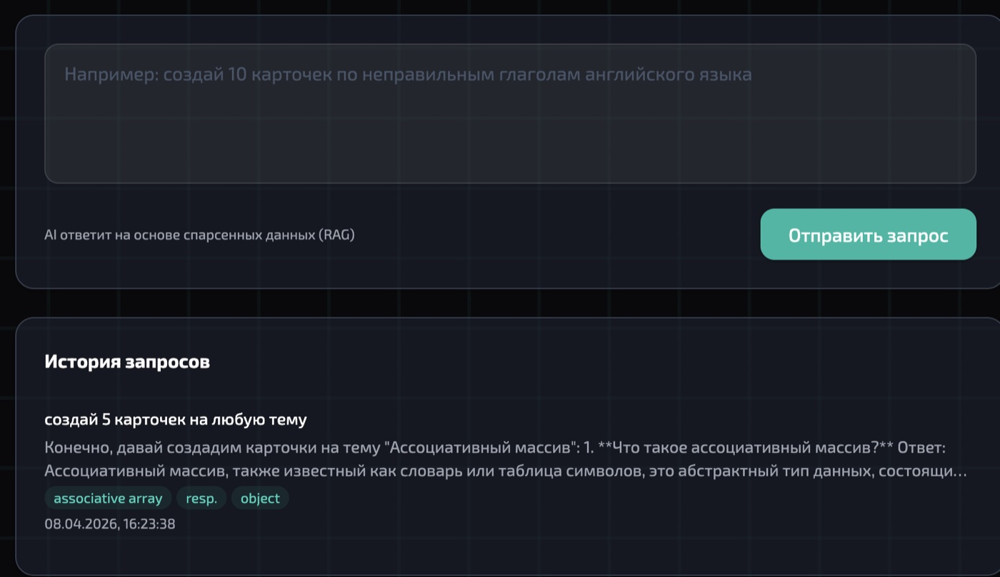 |
| 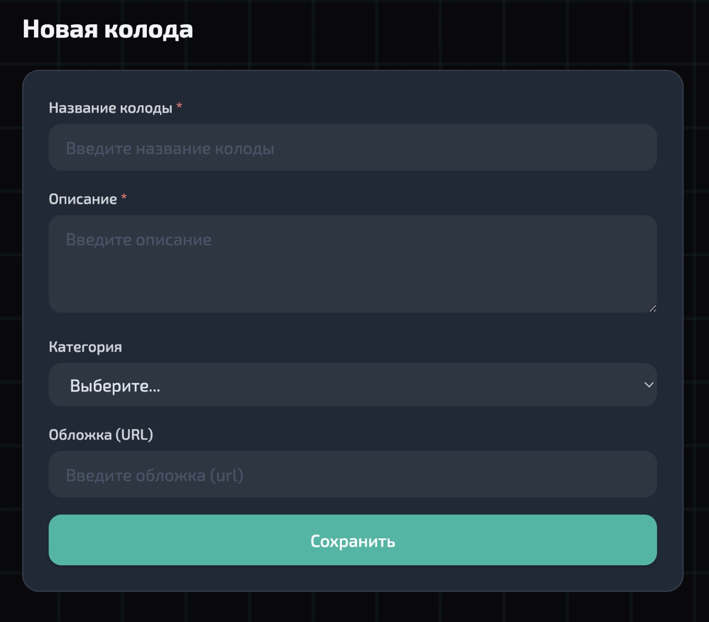 | 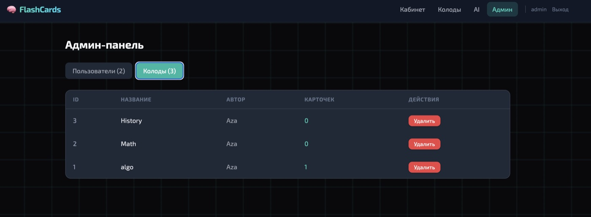 |
| 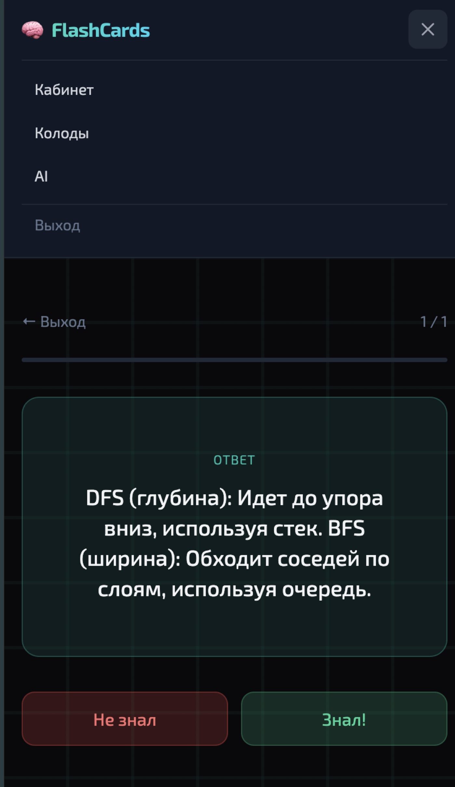|

## Стек

Django 5 • DRF • SimpleJWT • React 18 • Vite • Tailwind CSS • OpenAI • numpy
