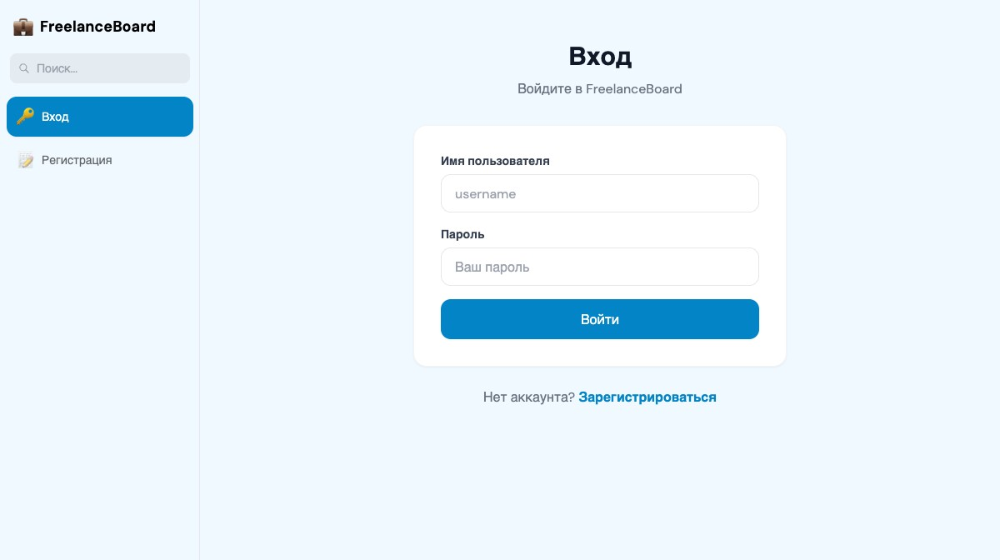
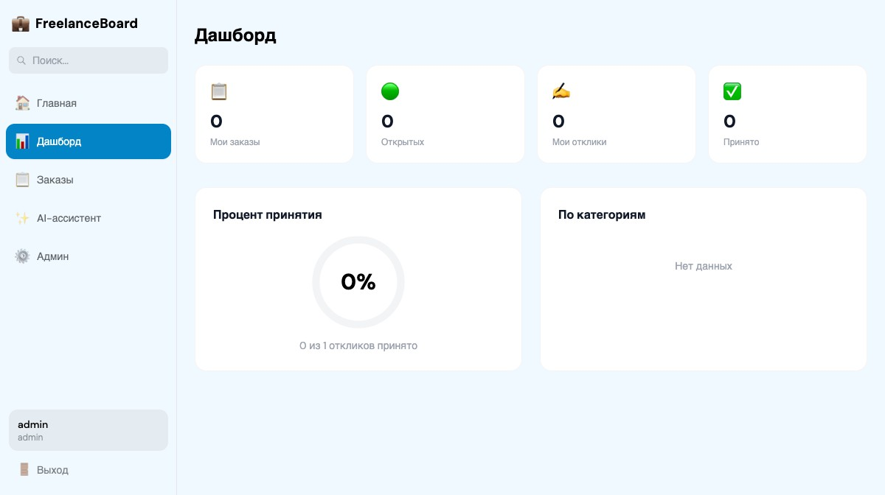
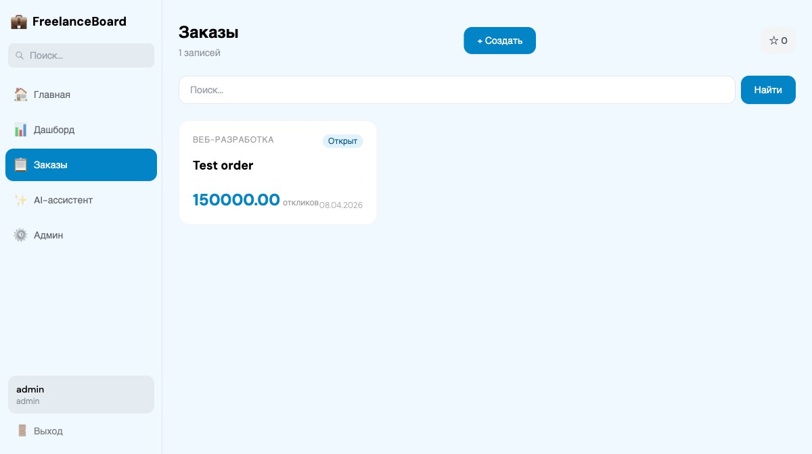
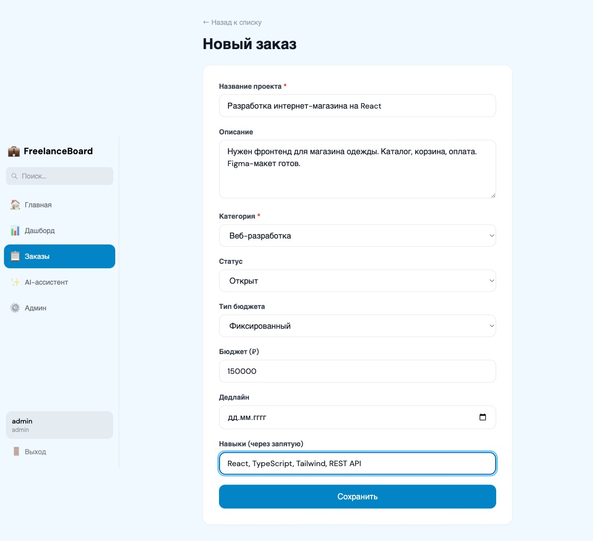
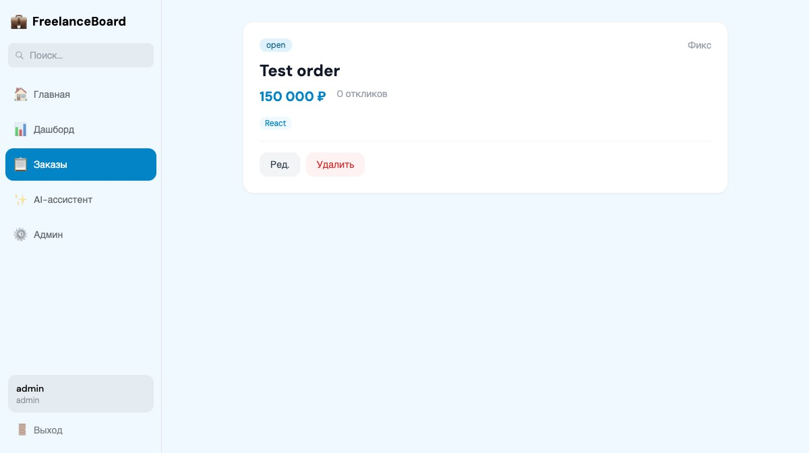
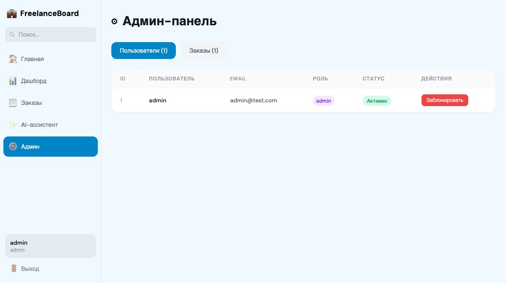
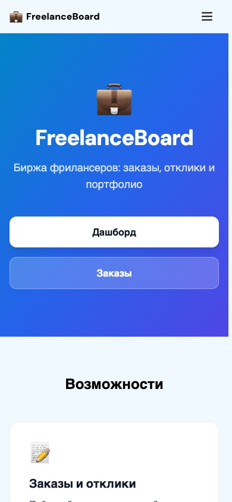

# FreelanceBoard

   

**Биржа фрилансеров с заказами и откликами**

---

### Ключевые особенности

| Функция | Описание |
|---------|----------|
| Auth | JWT (access + refresh) |
| Роли | User, Admin |
| Сущность | Заказ (CRUD) + Отклики |
| AI | GPT-3.5 + RAG с embeddings |
| Данные | Парсинг Wikipedia — IT-профессии, веб-разработка (BeautifulSoup) |
| UI | Sidebar + поиск, избранное (★), donut-графики |

### RAG Pipeline

```
Запрос → Embedding (text-embedding-3-small) → Cosine Search → Top-3 контекст → LLM → Ответ + Источники
```

### Скриншоты

#### Главная


#### Вход


#### Дашборд с графиком принятия откликов


#### Заказы

| Список заказов | Создание заказа |
|:--------------:|:---------------:|
|  |  |

#### Детальная страница (отклики)


#### AI-ассистент (Wizard-стиль)


#### Админ-панель


#### Мобильная версия


### Быстрый старт

```bash
# + cd frontend && npm run dev → http://localhost:5173
```
