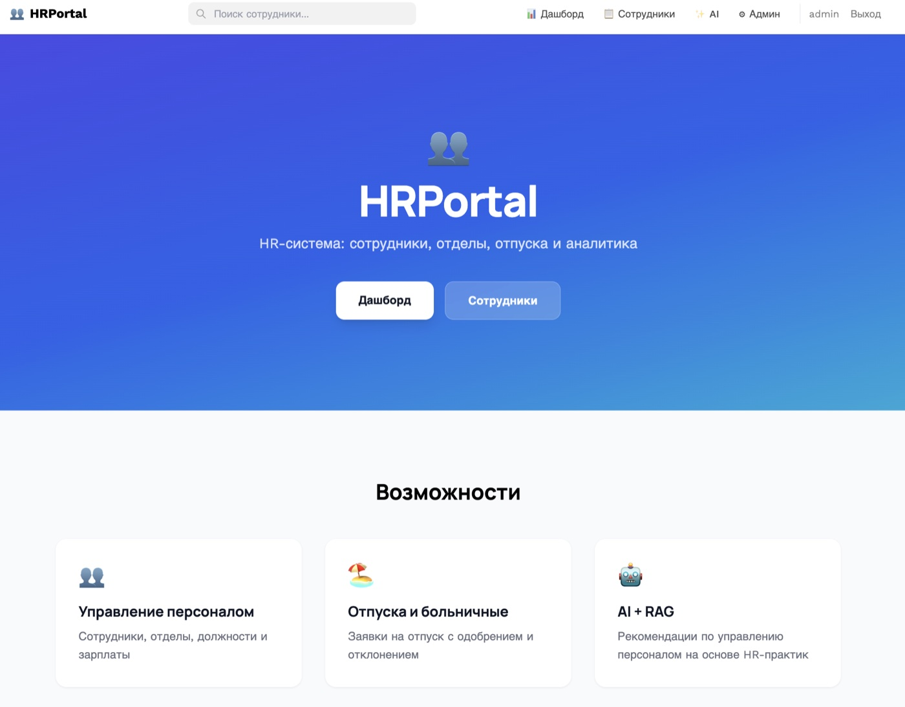
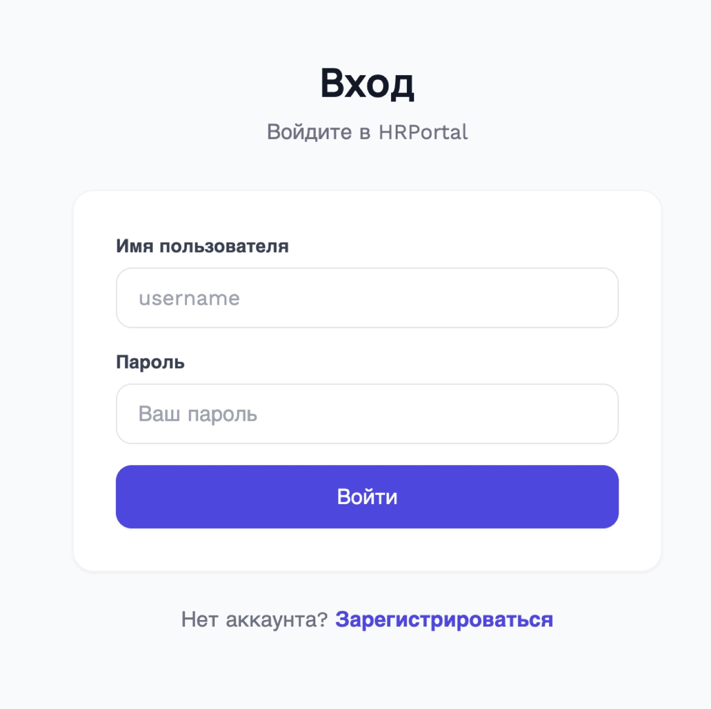
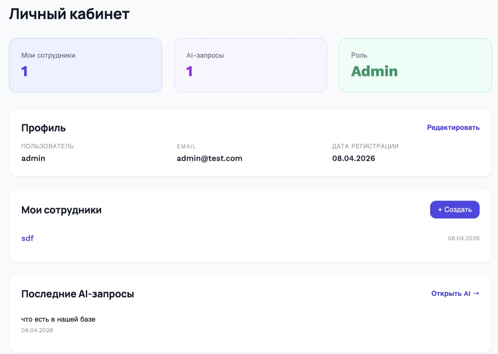
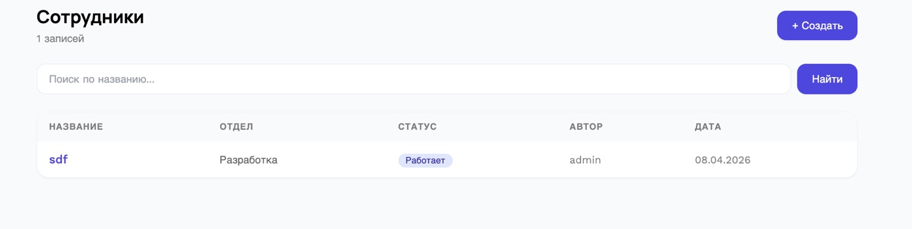
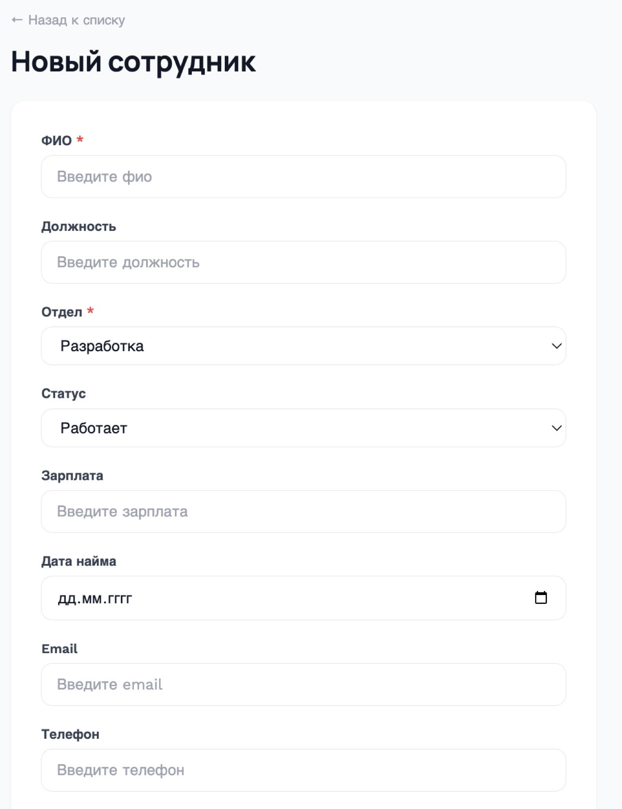
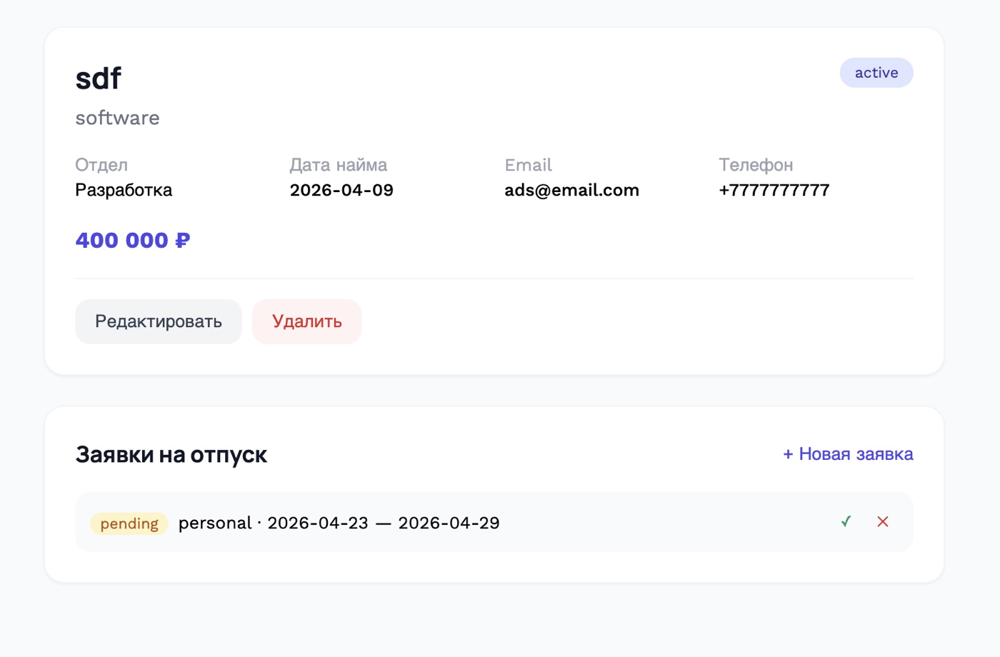
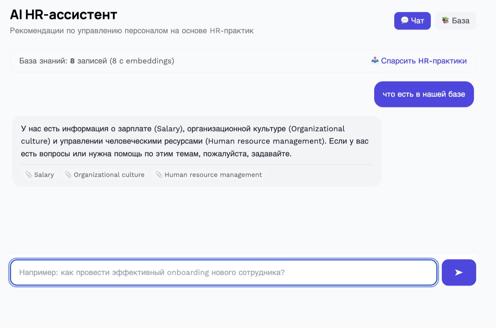
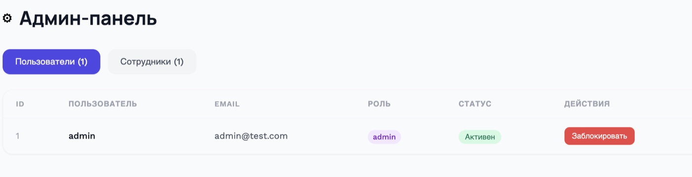
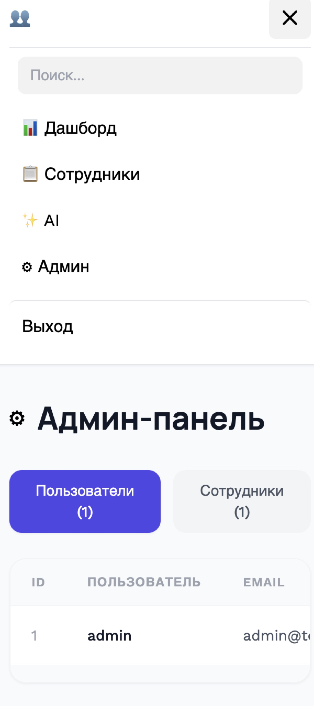

# HRPortal

HR-система управления персоналом и отпусками

## Архитектура

```
React 18 (Vite + Tailwind)
    ↕ REST API (JSON)
Django 5 (DRF + SimpleJWT)
    ↕ ORM
SQLite
    ↕
AI Module (OpenAI + RAG)
    ↕
Парсинг Wikipedia — HR-практики, трудовое право (BeautifulSoup)
```

## Backend

- Django 5 + DRF
- Auth: SimpleJWT
- Models: CustomUser, Item (сотрудник), LeaveRequest, KnowledgeBase, AIQuery
- Permissions: IsOwner, IsNotBlocked

## Frontend

- React 18, Vite, Tailwind CSS
- React Router v6, Topbar + поиск
- Context API (AuthContext)
- Axios + interceptors

## RAG

```
1. fetch_data() → парсинг Wikipedia (HR, onboarding, трудовое право...)
2. get_embedding(text) → text-embedding-3-small
3. KnowledgeBase.objects.create(embedding=vector)
4. search_knowledge(query) → cosine_similarity → top-3
5. generate_ai_response(prompt, context) → GPT-3.5
```

## Скриншоты

### Главная


### Вход


### Дашборд


### Сотрудники

| Список | Создание |
|:------:|:--------:|
|  |  |

### Детальная страница (заявки на отпуск)


### AI-ассистент (чат-пузыри)


### Админ-панель


### Мобильная версия


## Запуск

```bash
cd backend && python manage.py runserver
cd frontend && npm run dev
```
