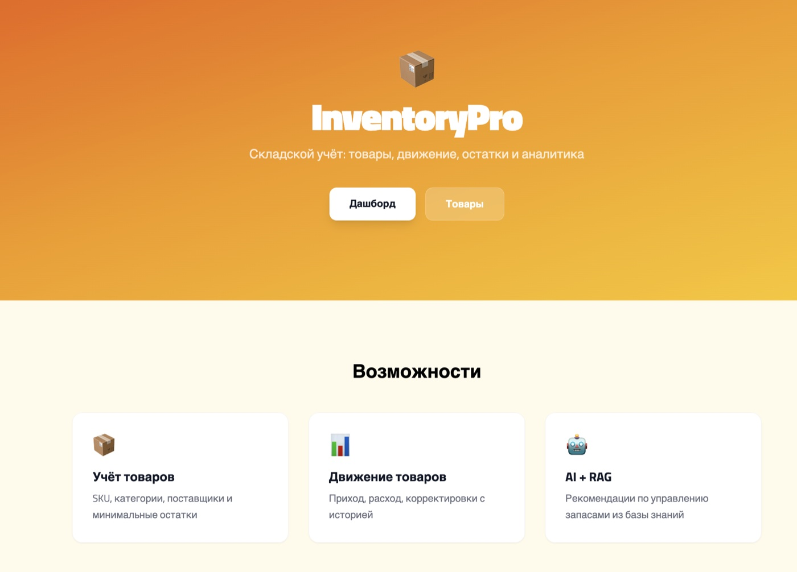
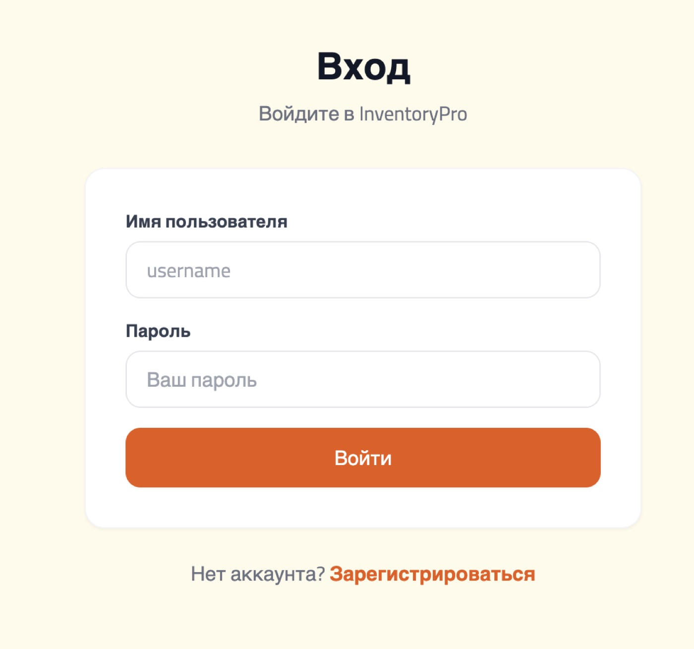
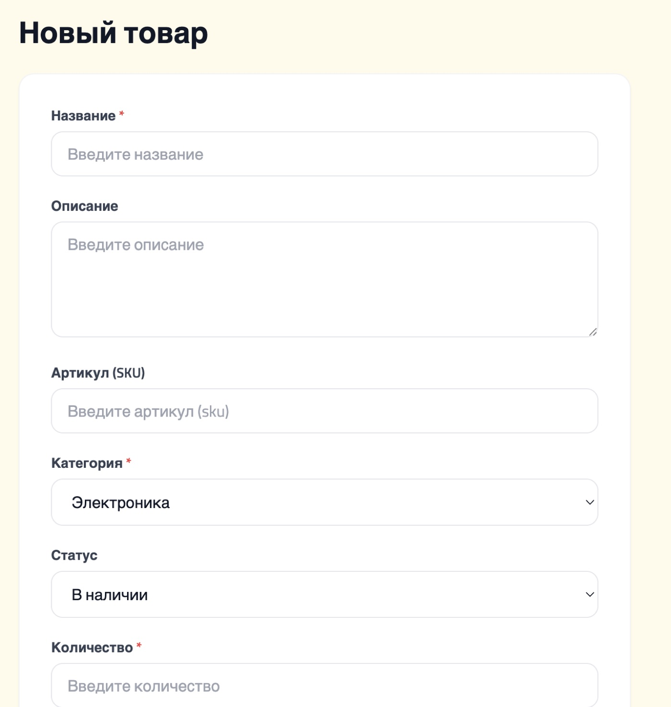
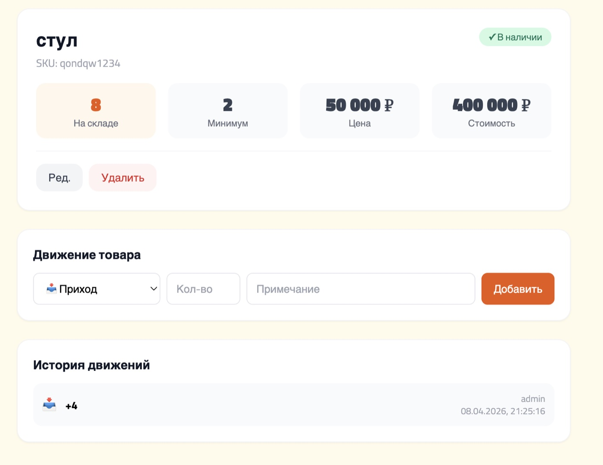
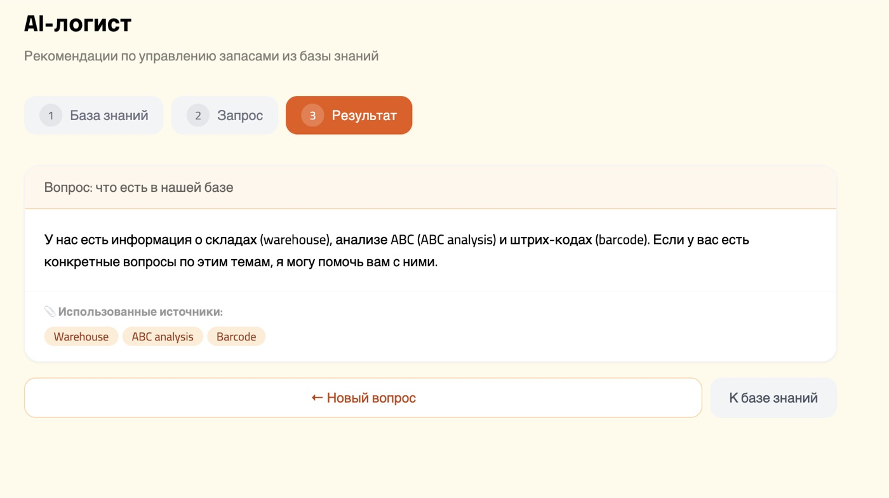
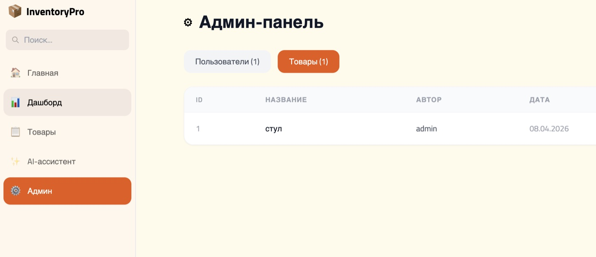
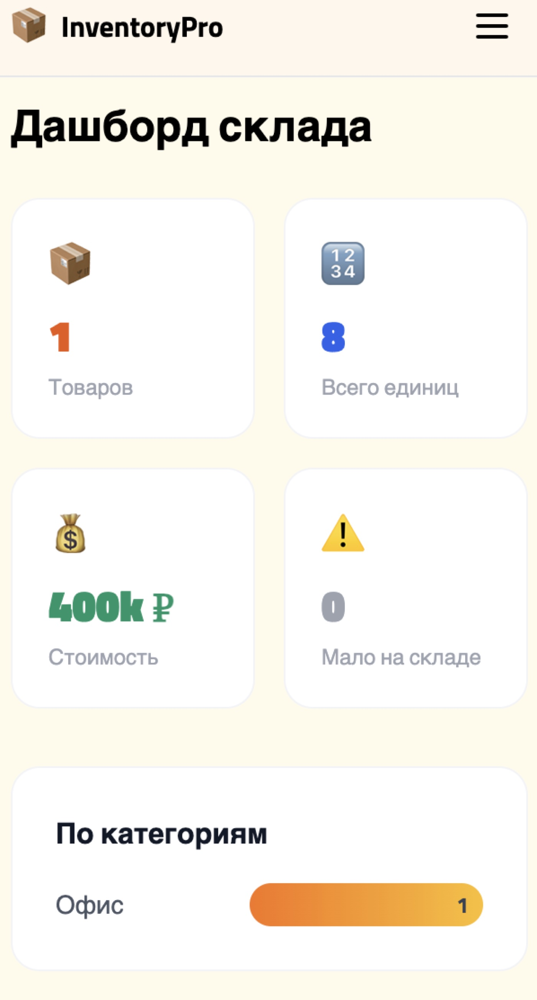

# InventoryPro

> Складской учёт с движением товаров и аналитикой

---

### Технологии

`Django 5` `DRF` `React 18` `Vite` `Tailwind CSS` `OpenAI` `SQLite`

### Данные и AI

Парсинг Wikipedia — логистика, JIT, ABC-анализ (BeautifulSoup)

RAG: text-embedding-3-small → cosine similarity → контекст в GPT-3.5

### Основные возможности

- JWT-авторизация (access + refresh)
- Роли: User / Admin
- CRUD: товар (SKU, категория, цена, поставщик)
- Приход / расход / корректировка с историей
- Дашборд с графиками и алертами "мало на складе"
- Избранные товары (★ закладки)
- AI-чат с RAG (Wizard-стиль)
- Sidebar + поиск навигация
- Адаптивный дизайн

### Скриншоты

#### Главная


#### Вход


#### Товары

| Список | Создание |
|:------:|:--------:|
|  |  |

#### Детальная страница (движение товара)


#### AI-ассистент


#### Админ-панель


#### Мобильная версия


### Запуск

```bash
# Терминал 1: cd backend && python manage.py runserver
# Терминал 2: cd frontend && npm run dev
```
