# LangLearn

> Платформа для изучения иностранных языков с словарными коллекциями и квизами

---

### Технологии

`Django 5` `DRF` `React 18` `Vite` `Tailwind CSS` `OpenAI` `SQLite`

### Данные и AI

Dictionary API (dictionaryapi.dev) — определения, фонетика, примеры

RAG: text-embedding-3-small → cosine similarity → контекст в GPT-3.5

### Основные возможности

- JWT-авторизация (access + refresh)
- Роли: User / Admin
- CRUD: словарная коллекция
- Квизы по словам с результатами
- Дашборд с аналитикой
- AI-чат с RAG
- База знаний с поиском
- Админ-панель
- Адаптивный дизайн

### Скриншоты

#### Главная
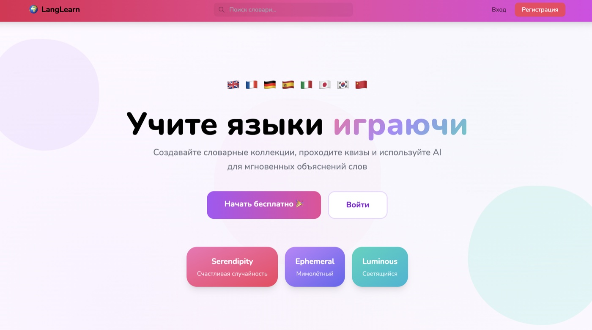

#### Регистрация
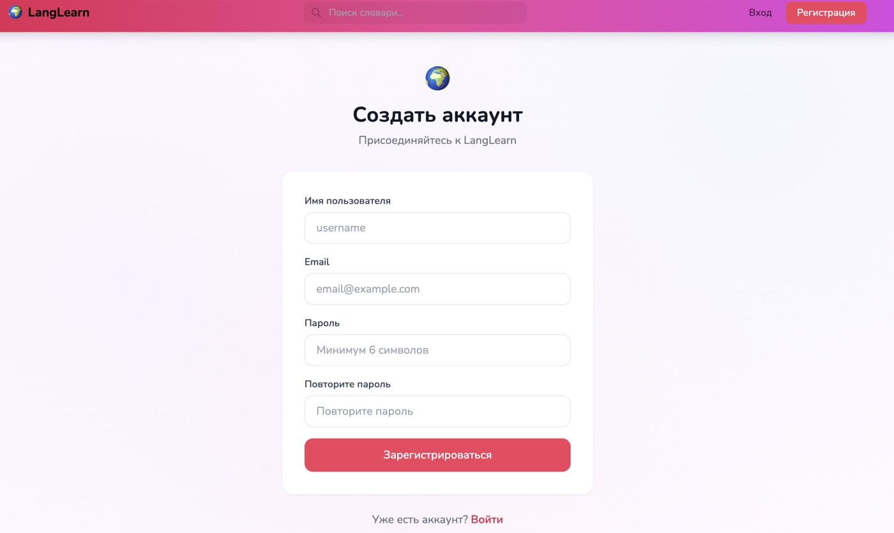

#### Дашборд
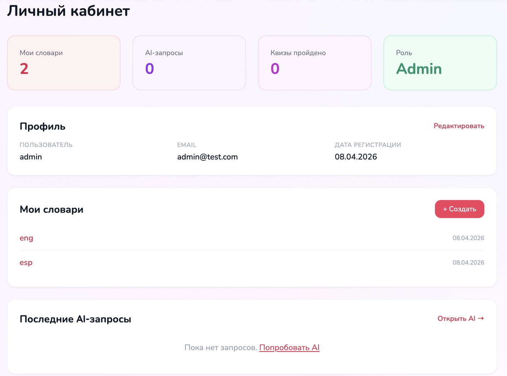

#### Список коллекций
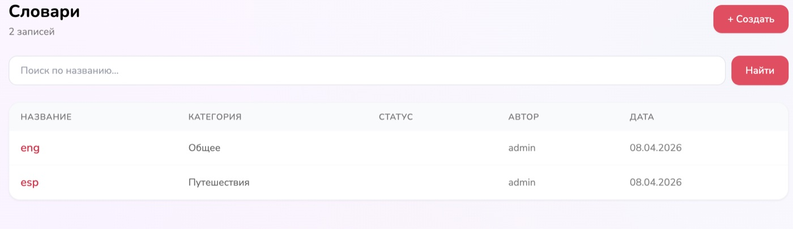

#### Детальная страница коллекции
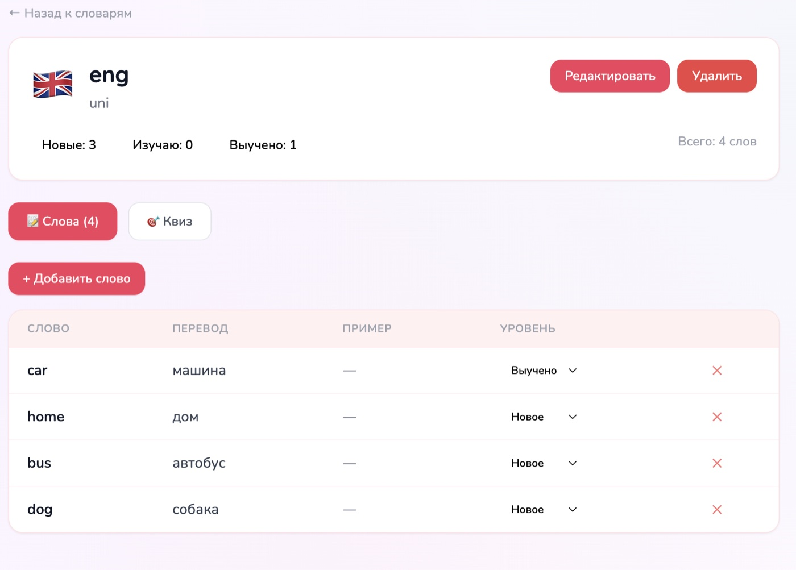

#### Квиз
| Прохождение квиза | Результат |
|:-----------------:|:---------:|
| 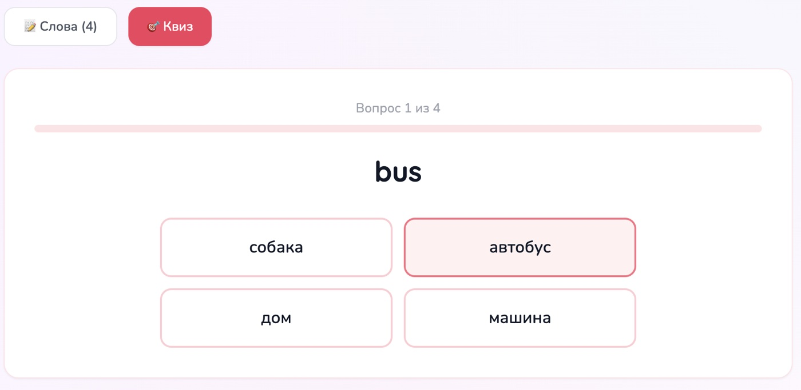 | 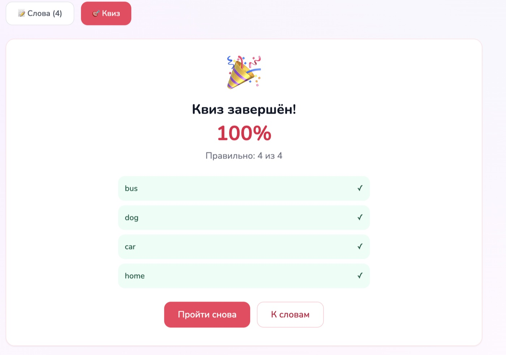 |

#### AI-ассистент с RAG
| Ответ AI с источниками | База знаний |
|:-----------------------:|:-----------:|
| 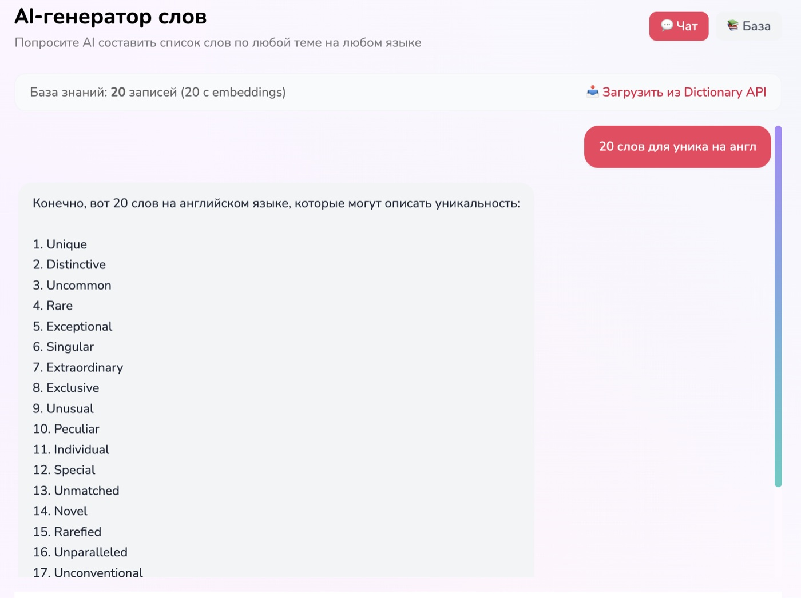 | 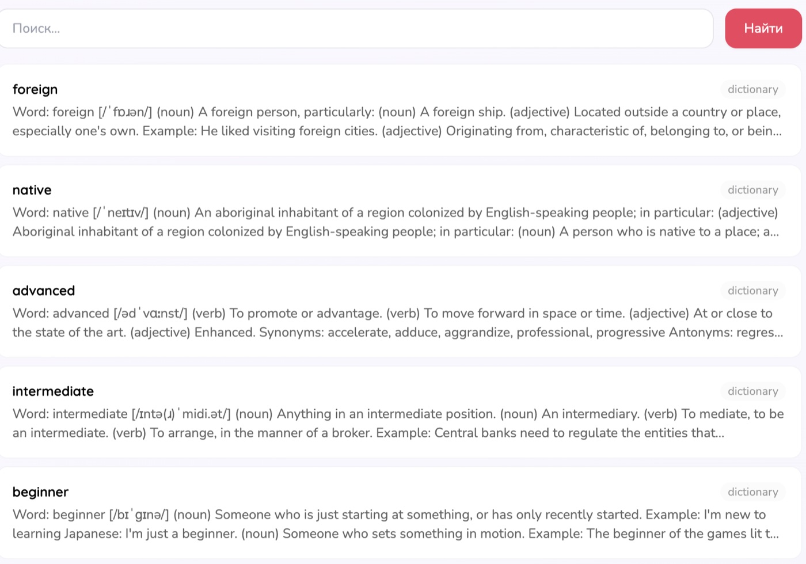 |

#### Админ-панель
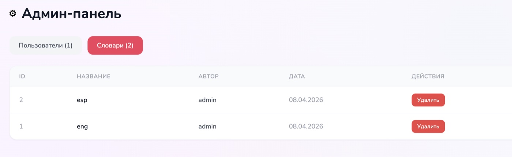

#### Мобильная версия
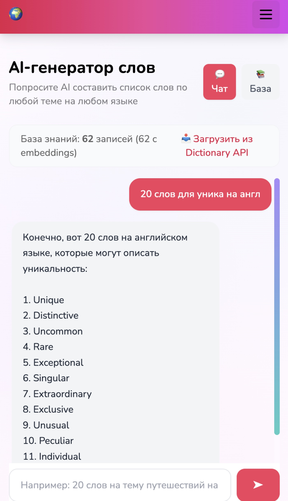

### Запуск

```bash
# Терминал 1: cd backend && python manage.py runserver
# Терминал 2: cd frontend && npm run dev
```
