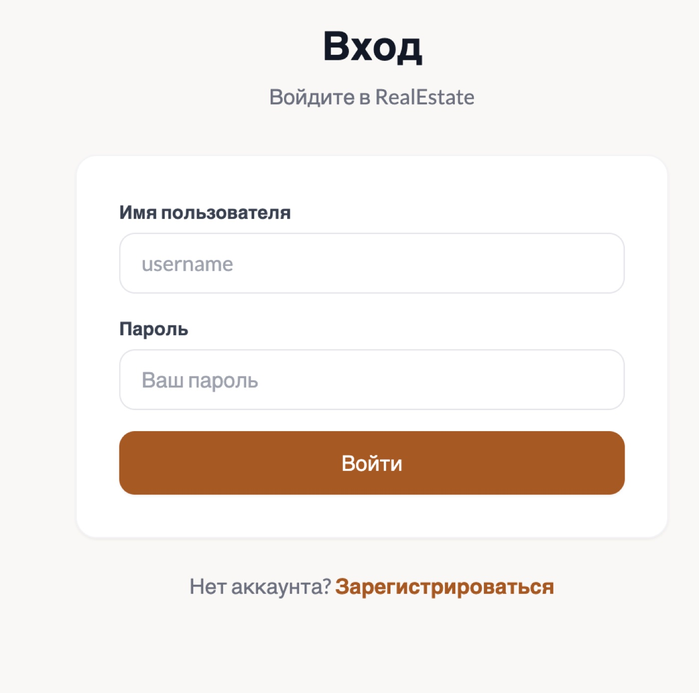
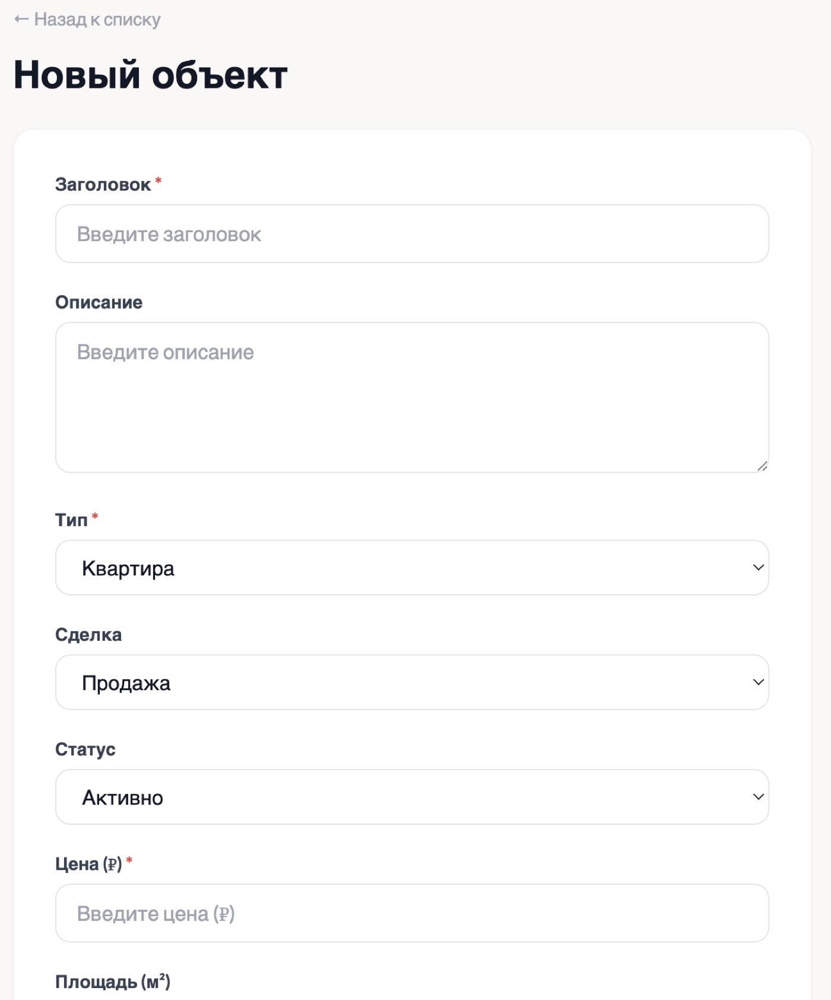
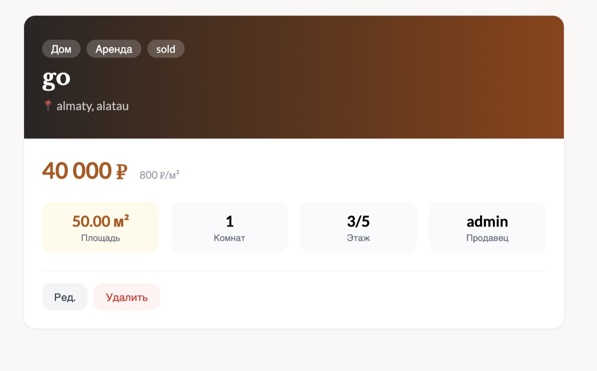
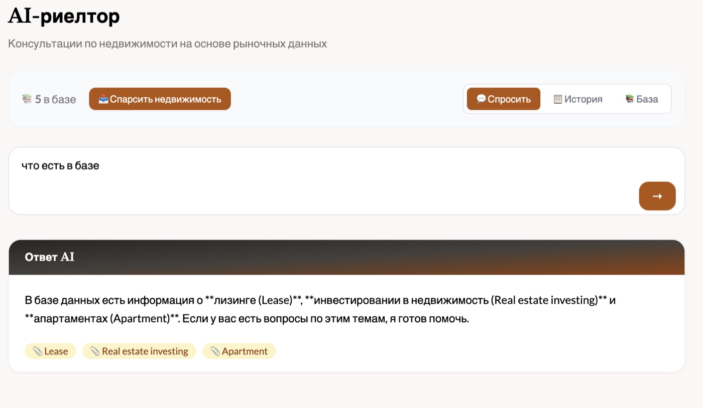
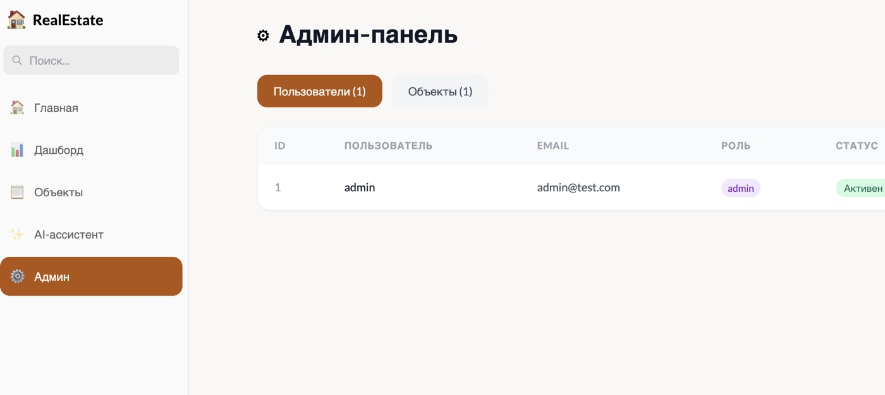
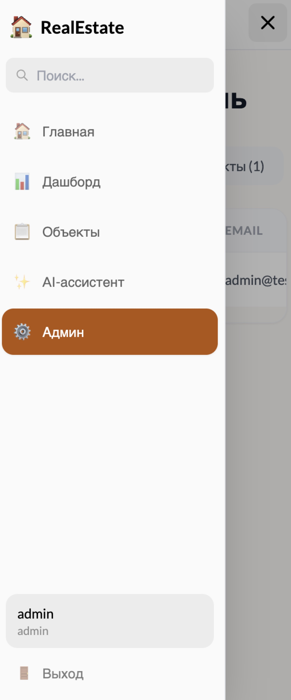

# RealEstate

Каталог недвижимости с фильтрами и аналитикой цен

## 🛠 Стек

- **Backend:** Django 5, DRF, SimpleJWT
- **Frontend:** React 18, Vite, Tailwind CSS
- **AI/ML:** OpenAI, text-embedding-3-small, cosine similarity
- **Данные:** Парсинг Wikipedia — ипотека, оценка, аренда (BeautifulSoup)

## 📋 Функционал

**Пользователь:** регистрация, вход, CRUD (объект), цена за м², дашборд, AI-чат, избранное (★)

**Администратор:** управление пользователями, модерация, блокировка

**AI + RAG:** загрузка данных → embeddings → семантический поиск → ответ с источниками

## 📸 Скриншоты

#### Главная


#### Вход


#### Объекты

| Список | Создание |
|:------:|:--------:|
|  |  |

#### Детальная страница (цена за м²)


#### AI-ассистент с RAG


#### Админ-панель


#### Мобильная версия


## 🚀 Запуск

```bash
cd backend && python manage.py runserver
cd frontend && npm run dev
```

## 🔌 API

- `POST /api/auth/register/` — регистрация
- `POST /api/auth/login/` — JWT
- `GET/POST /api/items/` — CRUD
- `GET /api/items/my-stats/` — аналитика
- `POST /api/ai/generate/` — AI (RAG)
- `POST /api/ai/fetch-data/` — загрузка данных
- `GET /api/ai/knowledge/` — база знаний
