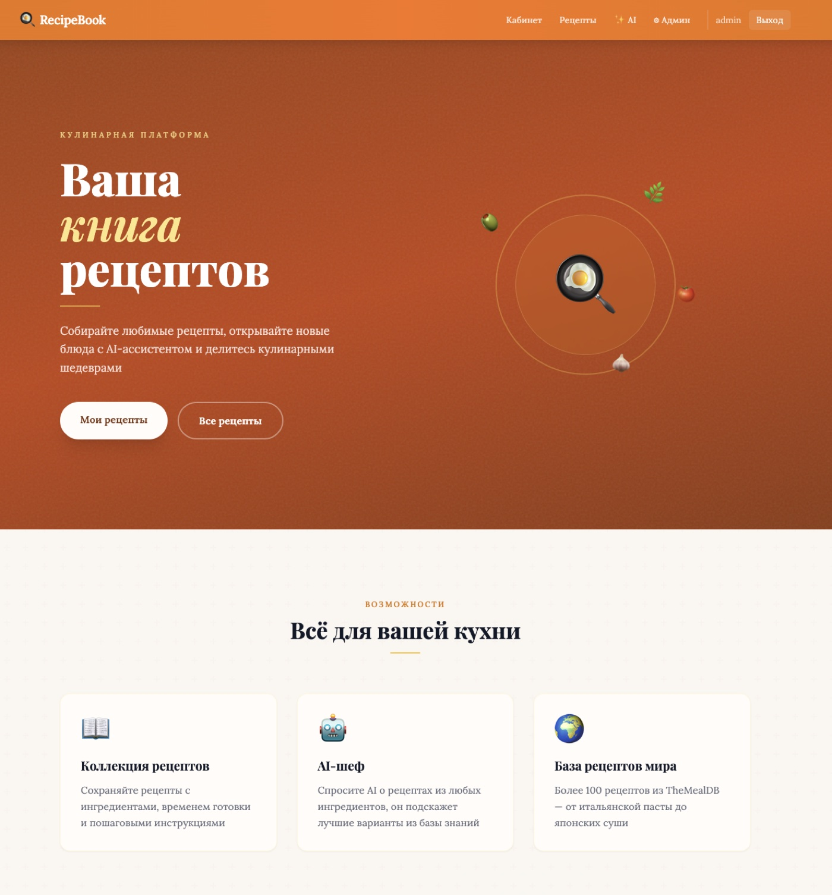
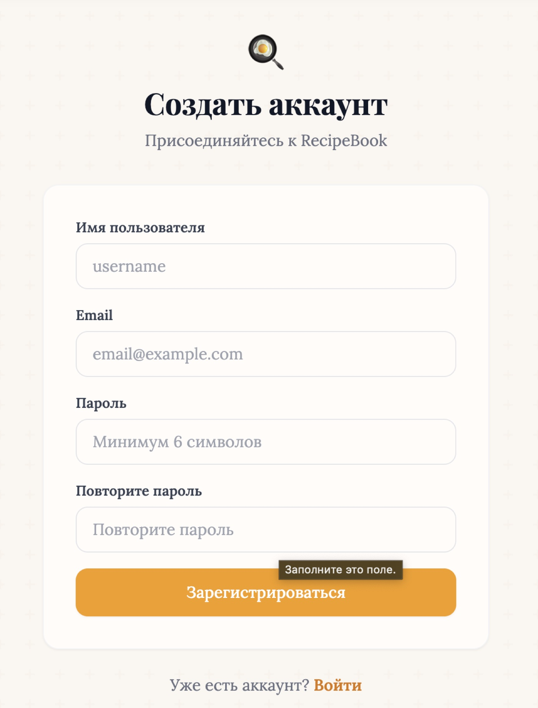
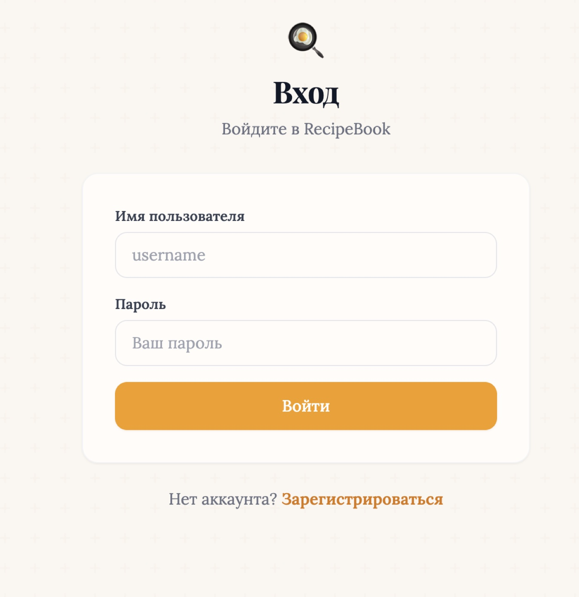
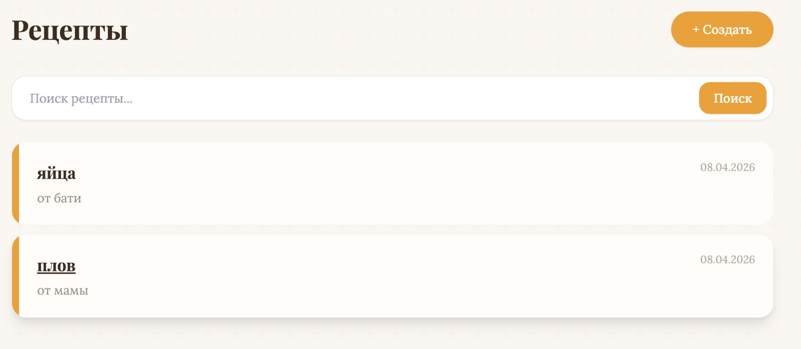
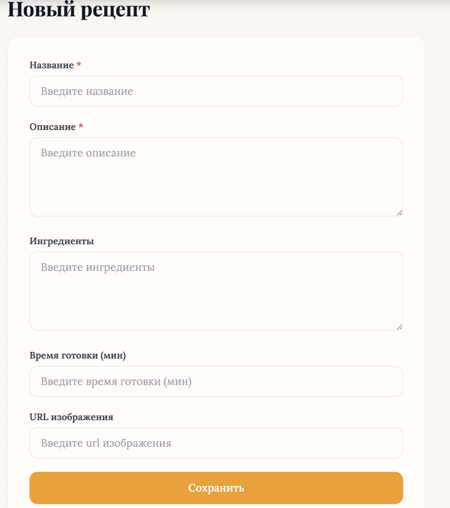
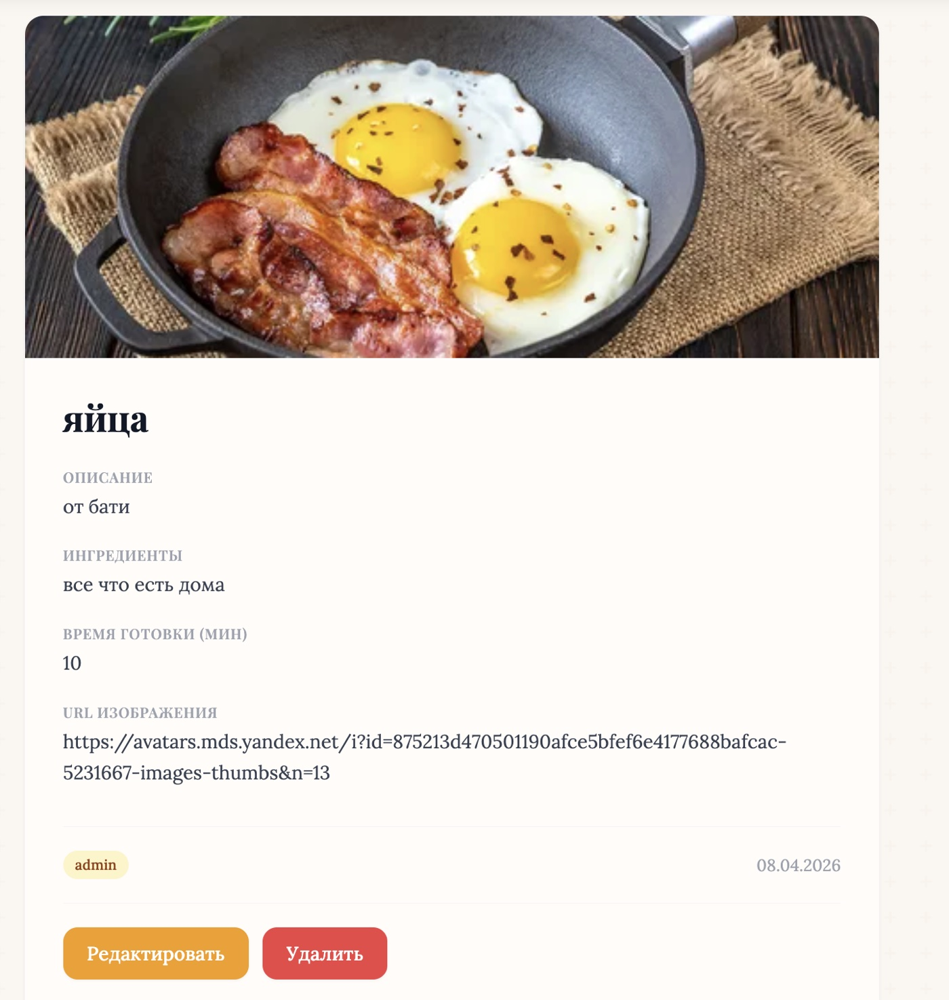
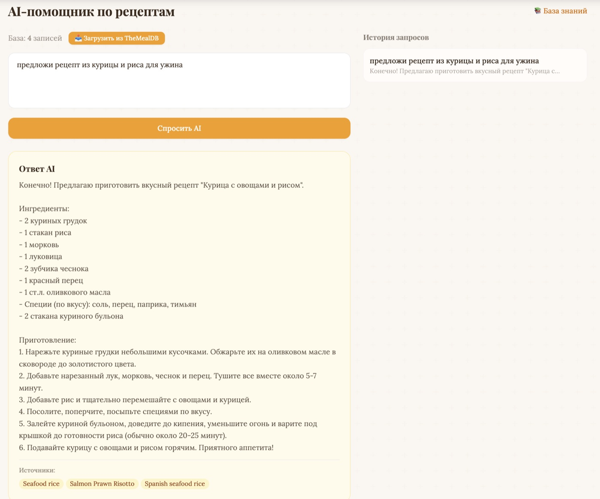
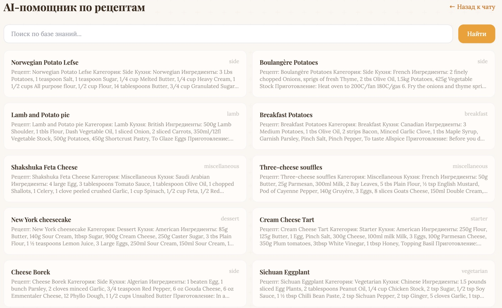
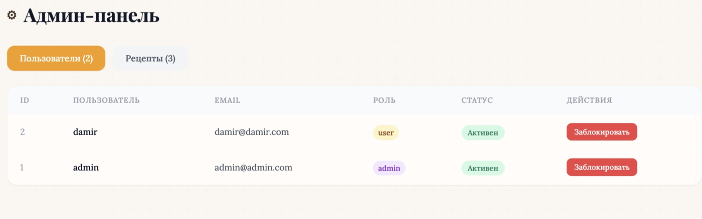
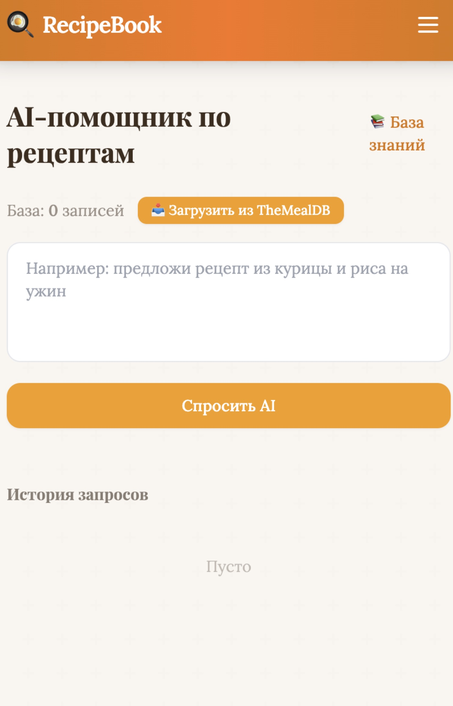

# RecipeBook

Веб-приложение для хранения кулинарных рецептов с интеллектуальным AI-ассистентом.

## О проекте

RecipeBook помогает собирать рецепты в одном месте. Добавляйте ингредиенты, время готовки, описания — и получайте рекомендации от AI на основе реальной базы рецептов TheMealDB.

## Стек технологий

**Backend:** Django 5, Django REST Framework, SimpleJWT, SQLite  
**Frontend:** React 18, Vite, Tailwind CSS, React Router  
**AI:** OpenAI GPT-3.5 + RAG (text-embedding-3-small, cosine similarity)  
**Данные:** TheMealDB API — рецепты со всего мира

## Функционал

- Авторизация и регистрация (JWT)
- Роли: пользователь / администратор
- CRUD рецептов (название, ингредиенты, время, описание)
- Личный кабинет со статистикой
- AI-ассистент с RAG — ответы на основе загруженных рецептов
- База знаний: ~100 рецептов из TheMealDB с embeddings
- Кастомная админ-панель (блокировка пользователей, модерация)
- Адаптивный дизайн (desktop + mobile)

## Скриншоты

### Главная страница


### Регистрация и вход

| Регистрация | Вход |
|:-----------:|:----:|
|  |  |

### Рецепты

| Список рецептов | Создание рецепта |
|:---------------:|:----------------:|
|  |  |

### Детальная страница рецепта


### AI-ассистент с RAG

| Ответ AI с источниками | База знаний |
|:-----------------------:|:-----------:|
|  |  |

### Админ-панель


### Мобильная версия


## Установка и запуск

```bash

# Backend (терминал 1)
cd backend
source /path/to/shared_venv/bin/activate
python manage.py runserver

# Frontend (терминал 2)
cd frontend
npm run dev
```

Открыть http://localhost:5173  
Админ: `admin` / `admin123`

## RAG Pipeline

1. Данные загружаются из TheMealDB API (20 категорий, ~100 рецептов)
2. Каждый рецепт сохраняется в `KnowledgeBase` с text-embedding-3-small
3. При запросе пользователя — cosine similarity поиск по embeddings
4. Топ-3 результата передаются как контекст в GPT-3.5
5. AI отвечает строго на основе найденных данных

## API

| Метод | Эндпоинт | Описание |
|-------|----------|----------|
| POST | `/api/auth/register/` | Регистрация |
| POST | `/api/auth/login/` | Авторизация (JWT) |
| GET/POST | `/api/items/` | Список / создание рецептов |
| GET/PUT/DELETE | `/api/items/:id/` | Рецепт (CRUD) |
| GET | `/api/items/my-stats/` | Статистика |
| POST | `/api/ai/generate/` | AI-генерация (RAG) |
| POST | `/api/ai/fetch-data/` | Загрузка рецептов из TheMealDB |
| GET | `/api/ai/knowledge/` | Просмотр базы знаний |
