# StudyNotes

Приложение для ведения учебных конспектов и заметок. Django 5 + React 18 + OpenAI RAG.

**Данные:** Wikipedia REST API — статьи по 25 учебным темам

### Запуск

### Что внутри
JWT-авторизация • Роли (user/admin) • CRUD заметка • Дашборд • AI с RAG • База знаний • Админ-панель • Мобильная версия

### Скриншоты

#### Главная
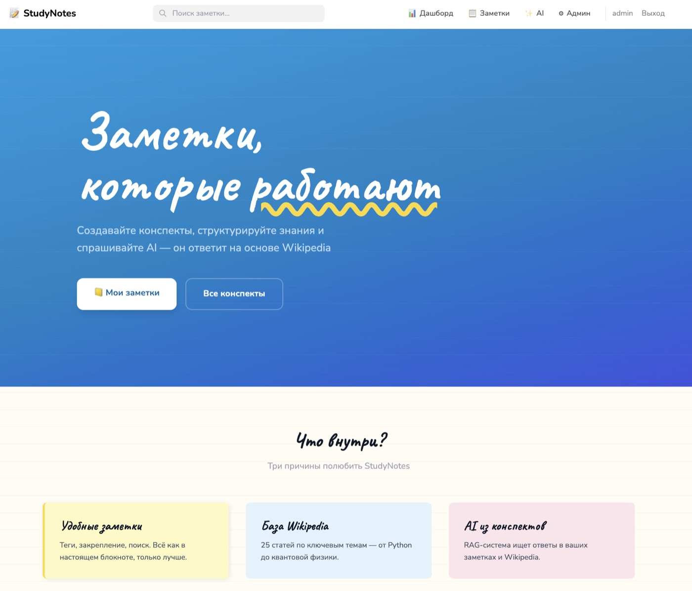

#### Регистрация и вход

| Регистрация | Вход |
|:-----------:|:----:|
| 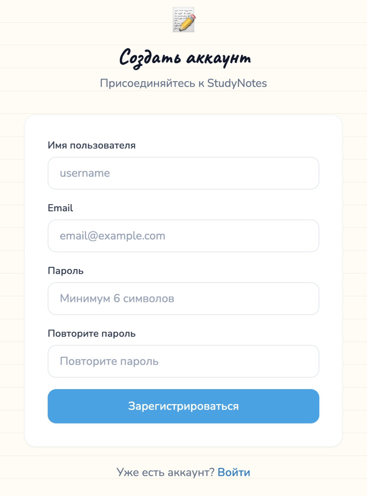 | 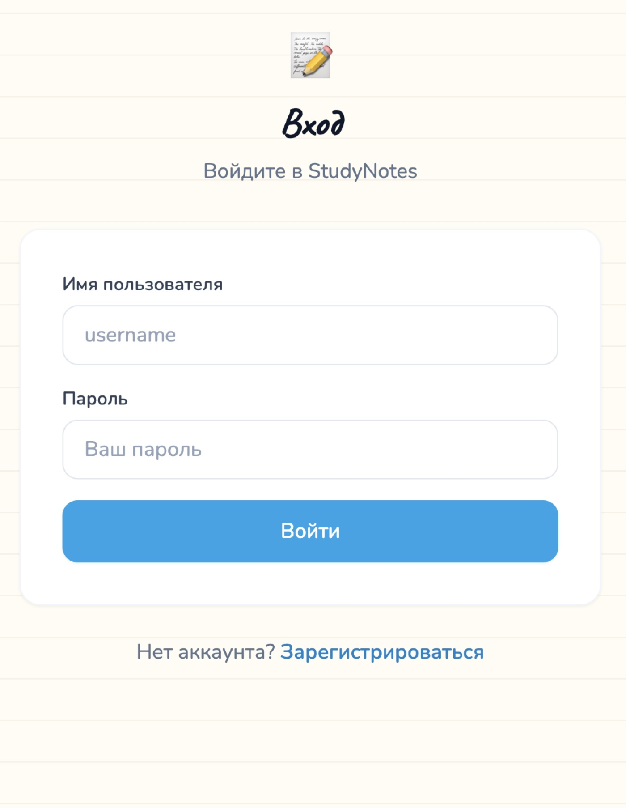 |

#### Дашборд
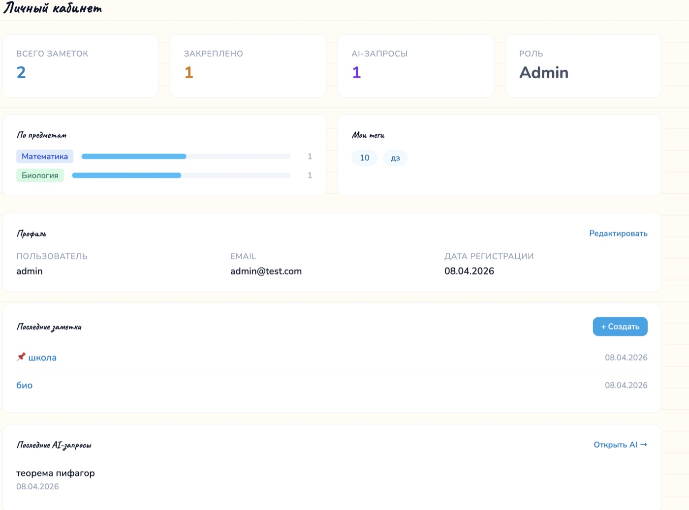

#### Заметки

| Список | Создание |
|:------:|:--------:|
| 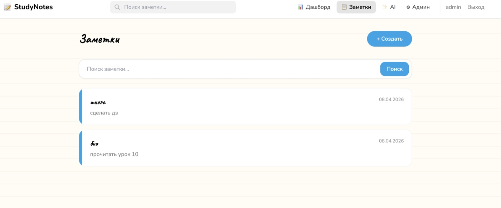 | 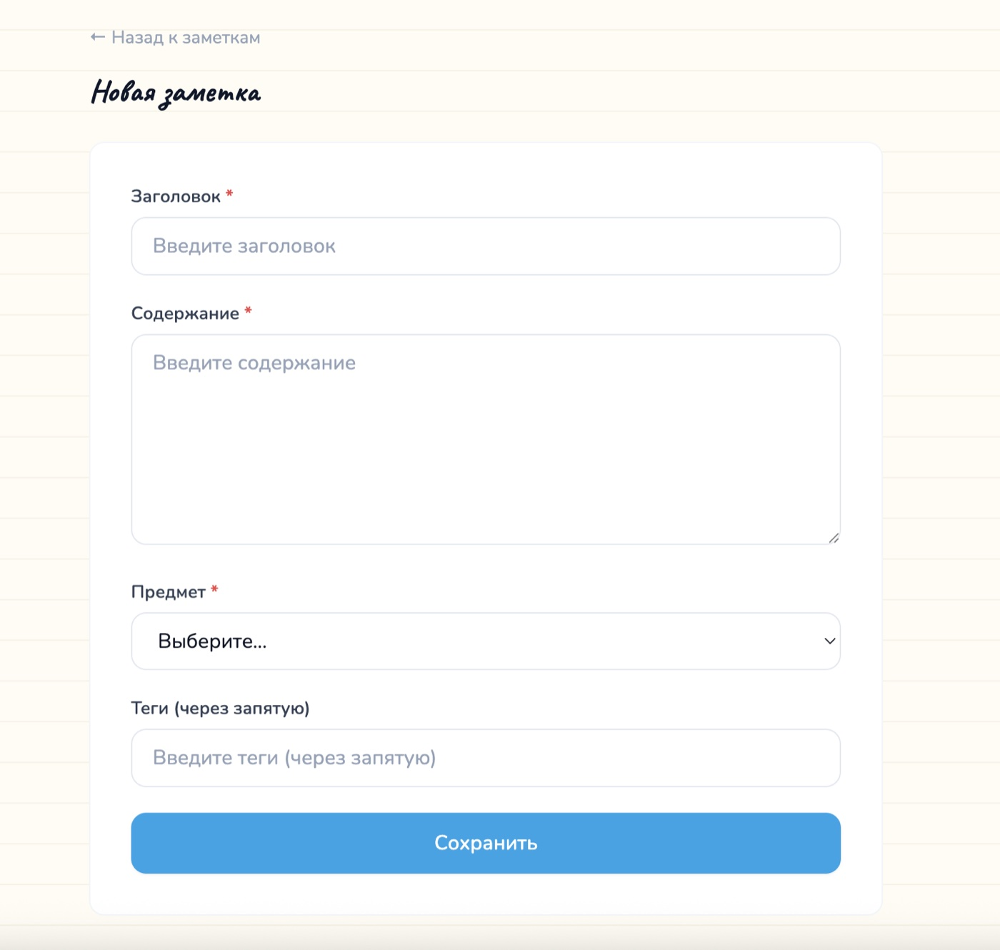 |

#### Детальная страница
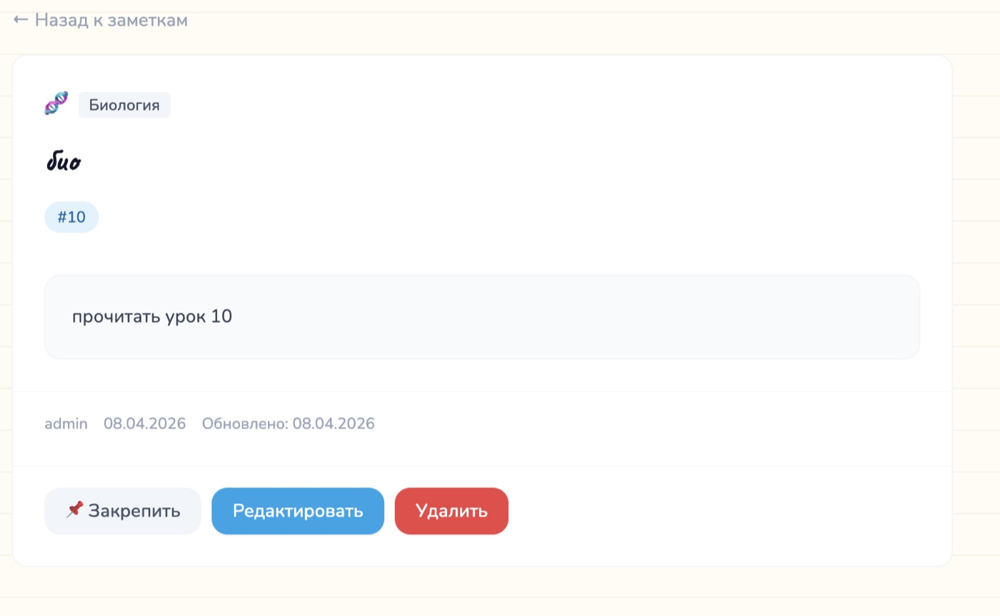

#### AI-ассистент с RAG

| Ответ AI с источниками | База знаний |
|:-----------------------:|:-----------:|
| 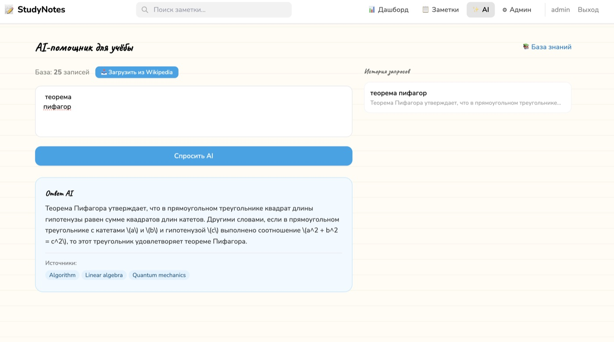 | 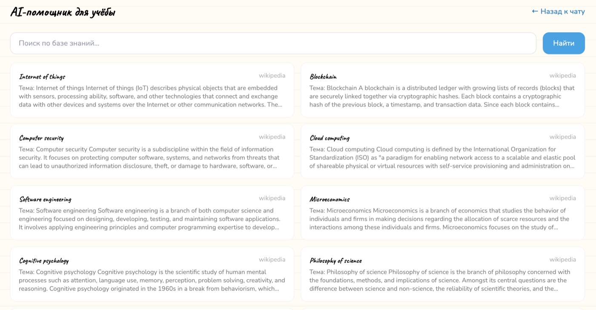 |

#### Админ-панель
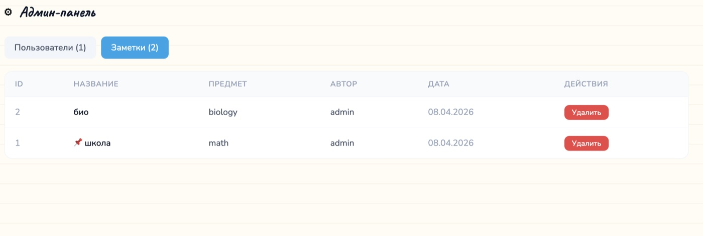

#### Мобильная версия
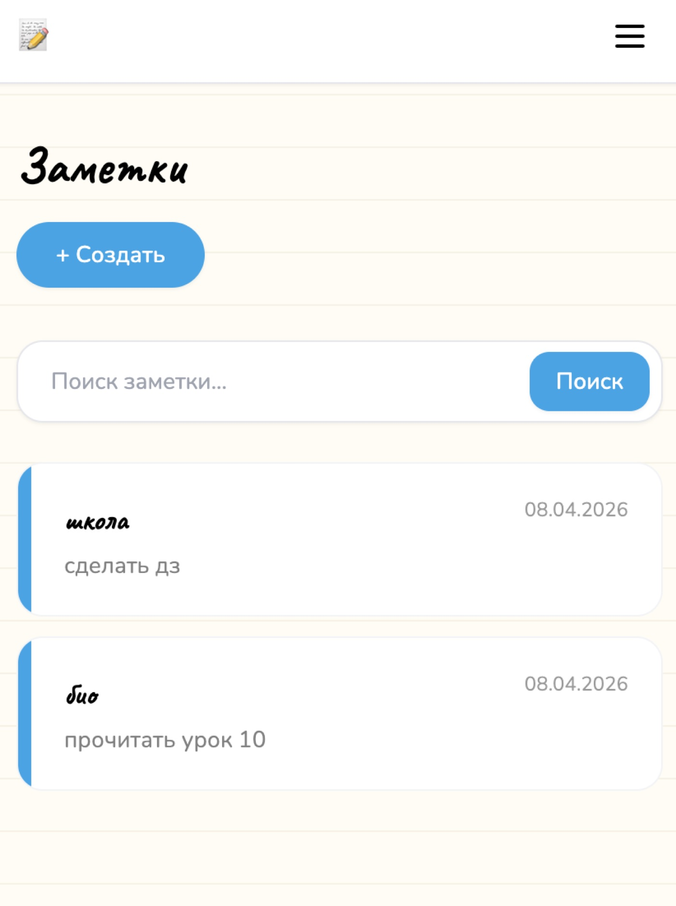

### API
`POST /api/auth/login/` • `GET/POST /api/items/` • `POST /api/ai/generate/` • `POST /api/ai/fetch-data/` • `GET /api/ai/knowledge/`
