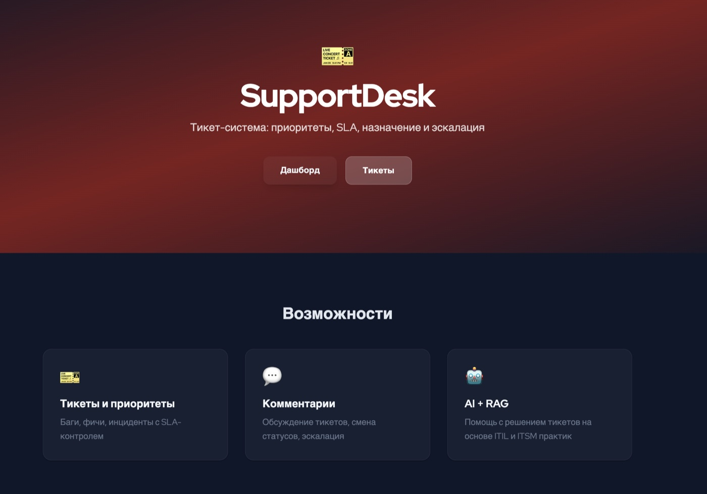
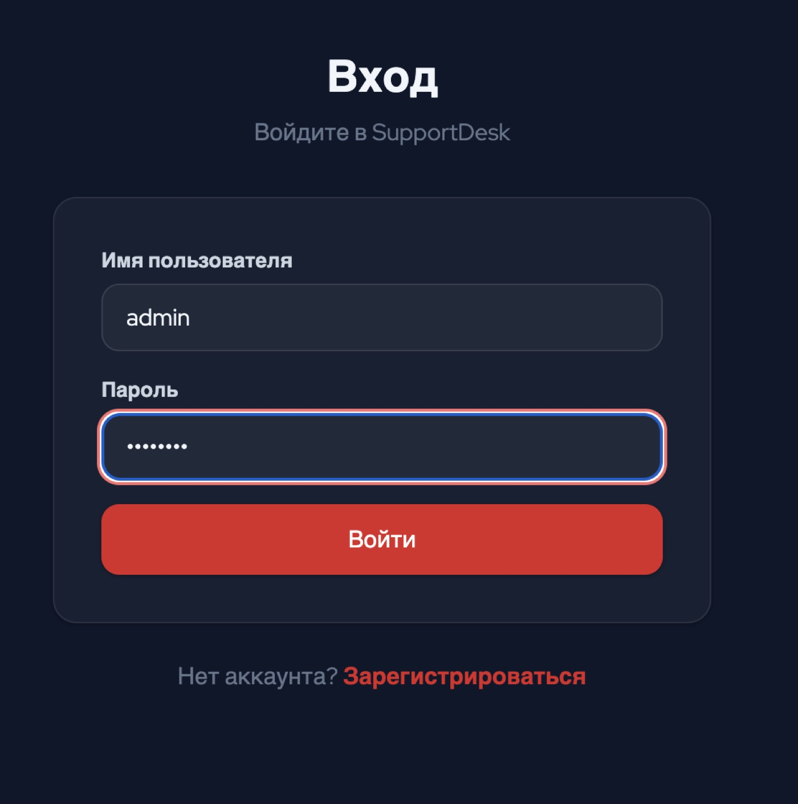
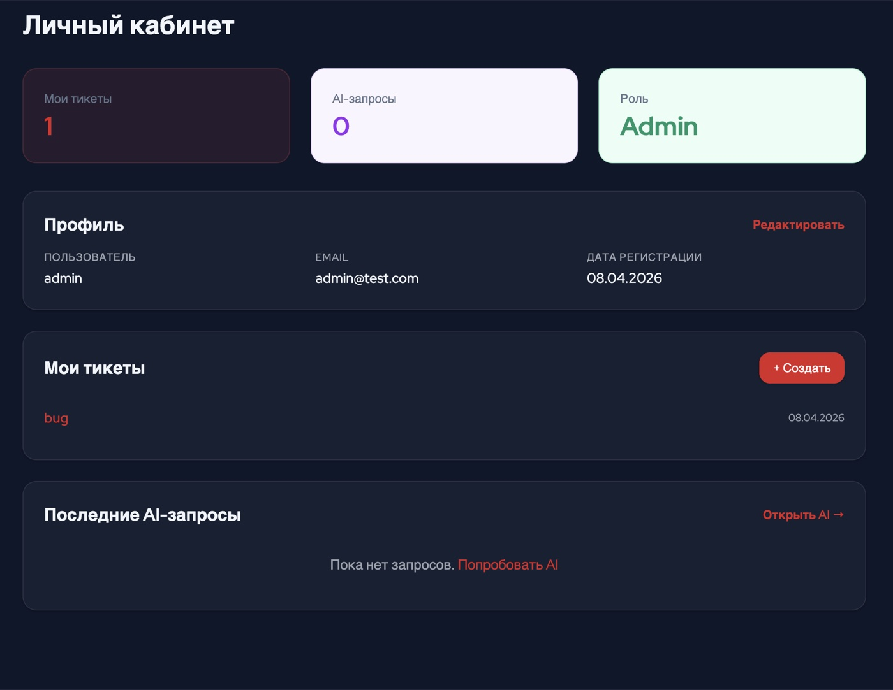
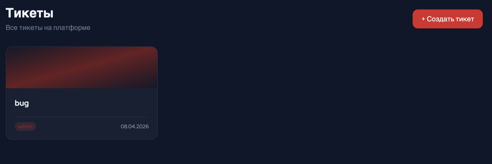
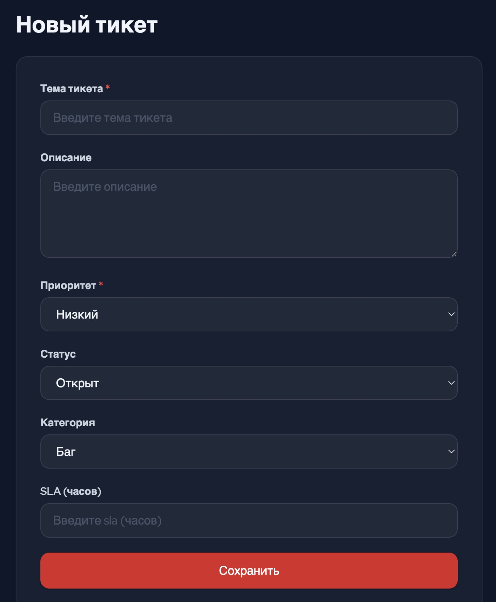
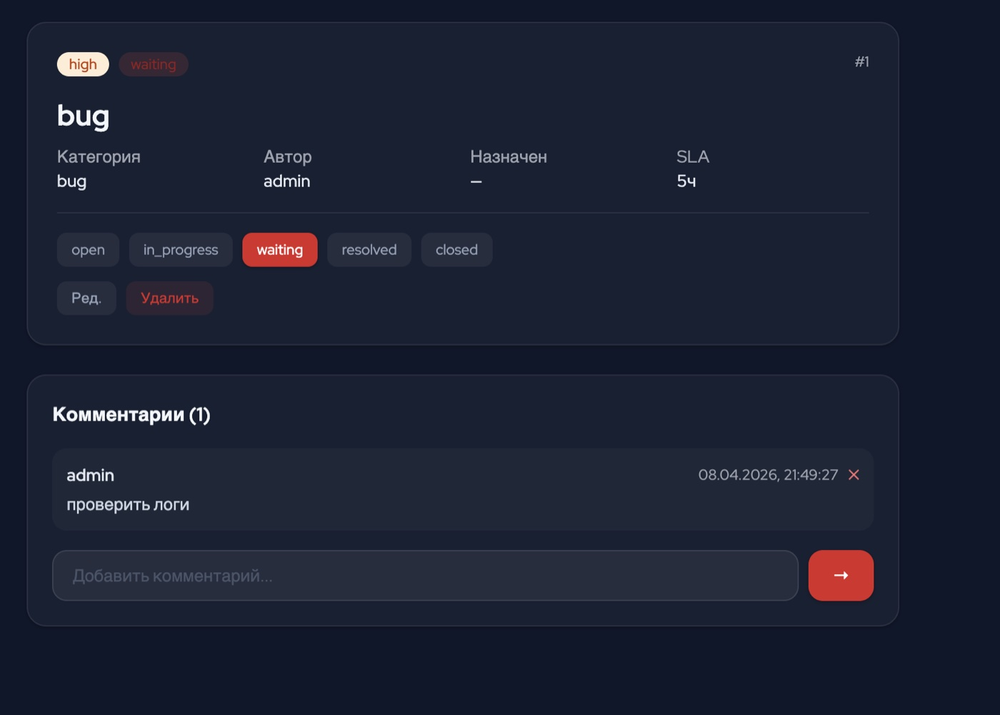
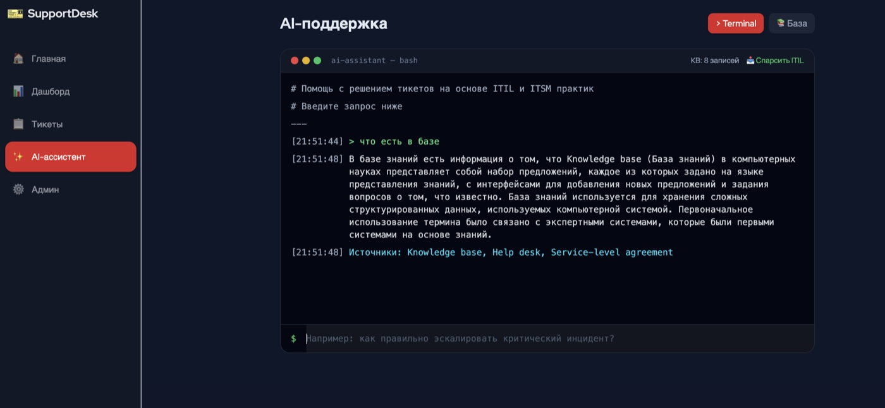
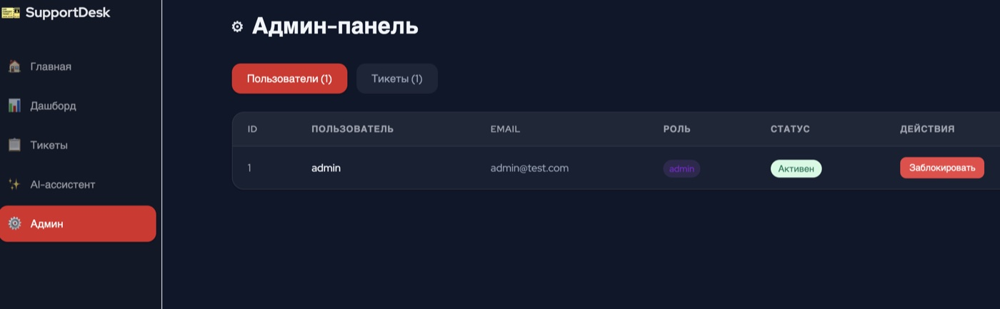
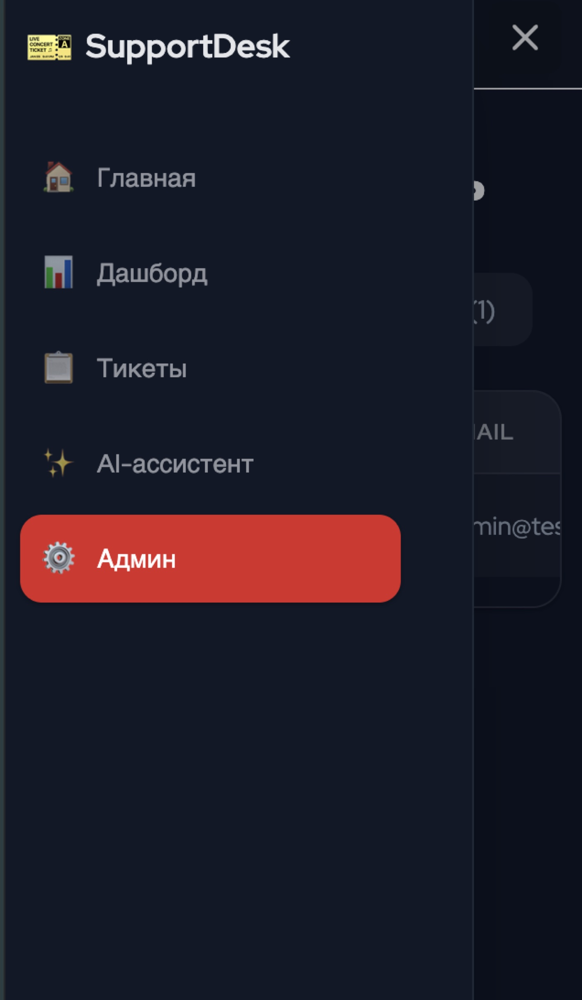

# SupportDesk

Тикет-система поддержки с SLA и приоритетами. Django 5 + React 18 + OpenAI RAG.

**Данные:** Парсинг Wikipedia — ITIL, SLA, ITSM (BeautifulSoup)

### Запуск

### Что внутри
JWT-авторизация • Роли (user/admin) • CRUD тикет • Приоритеты и SLA • Комментарии • Смена статусов • Дашборд • AI с RAG (Terminal-стиль) • Sidebar навигация • Мобильная версия

### Скриншоты

#### Главная

#### Вход

#### Дашборд

#### Тикеты

| Список | Создание |
|:------:|:--------:|
|  |  |

#### Детальная страница (комментарии + статусы)

#### AI-ассистент (Terminal)

#### Админ-панель

#### Мобильная версия

### API
`POST /api/auth/login/` • `GET/POST /api/items/` • `POST /api/ai/generate/` • `POST /api/ai/fetch-data/` • `GET /api/ai/knowledge/`
