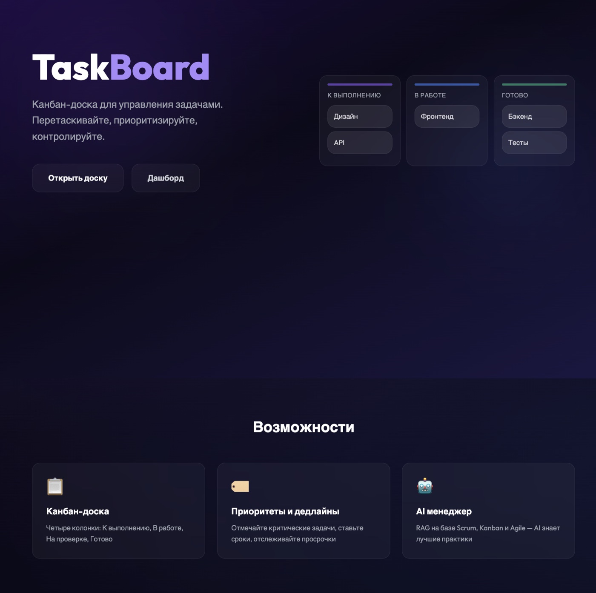
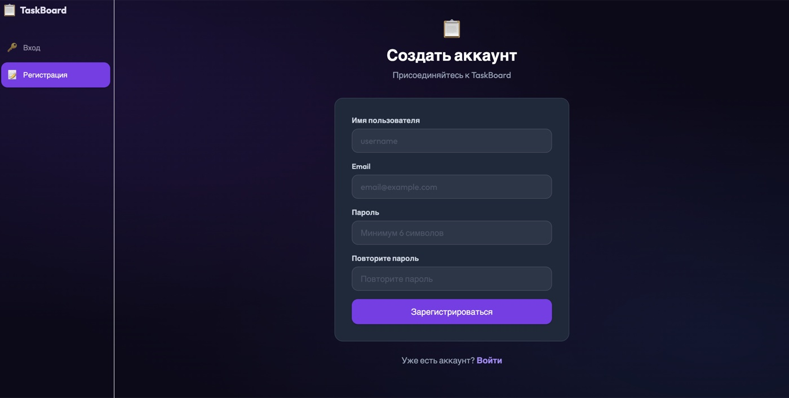
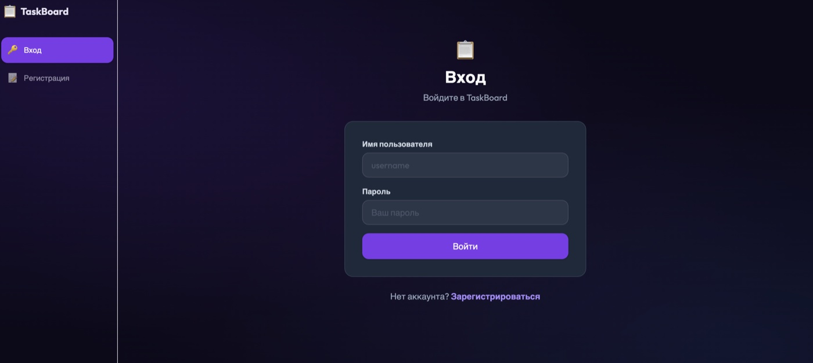
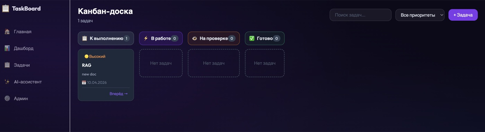
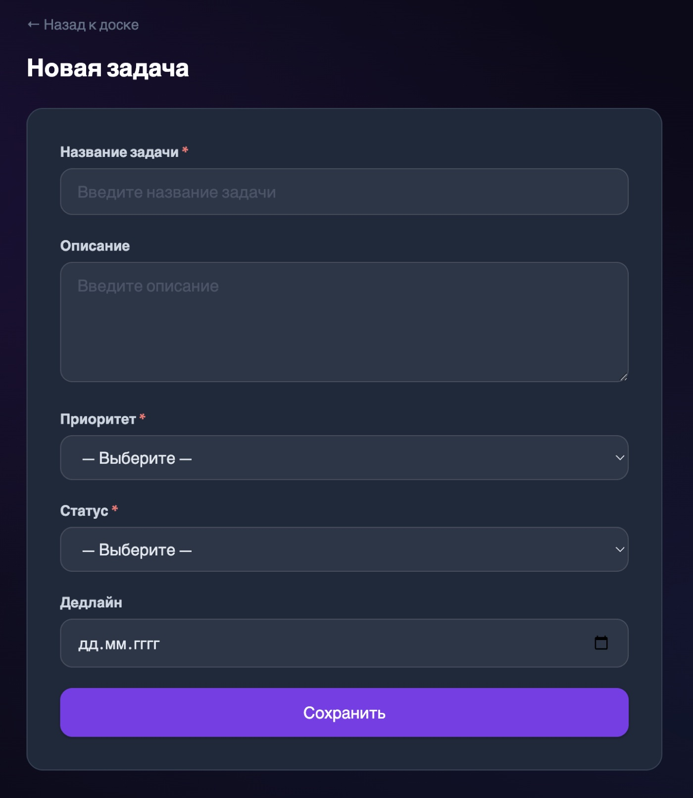
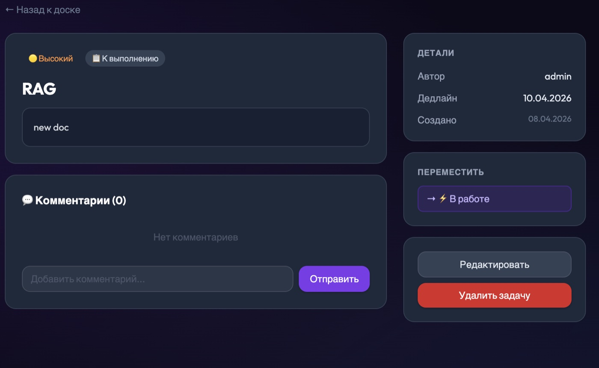
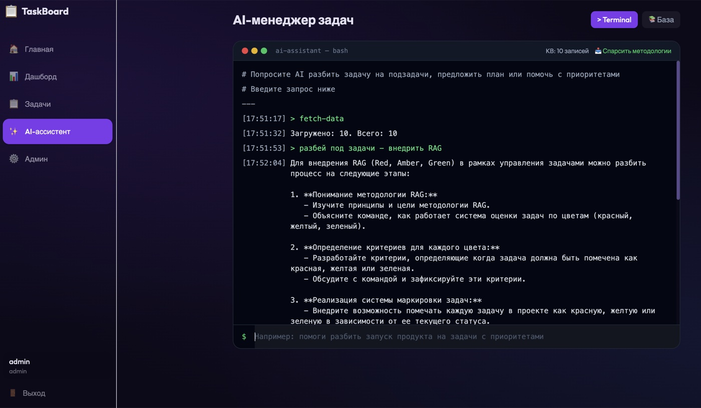
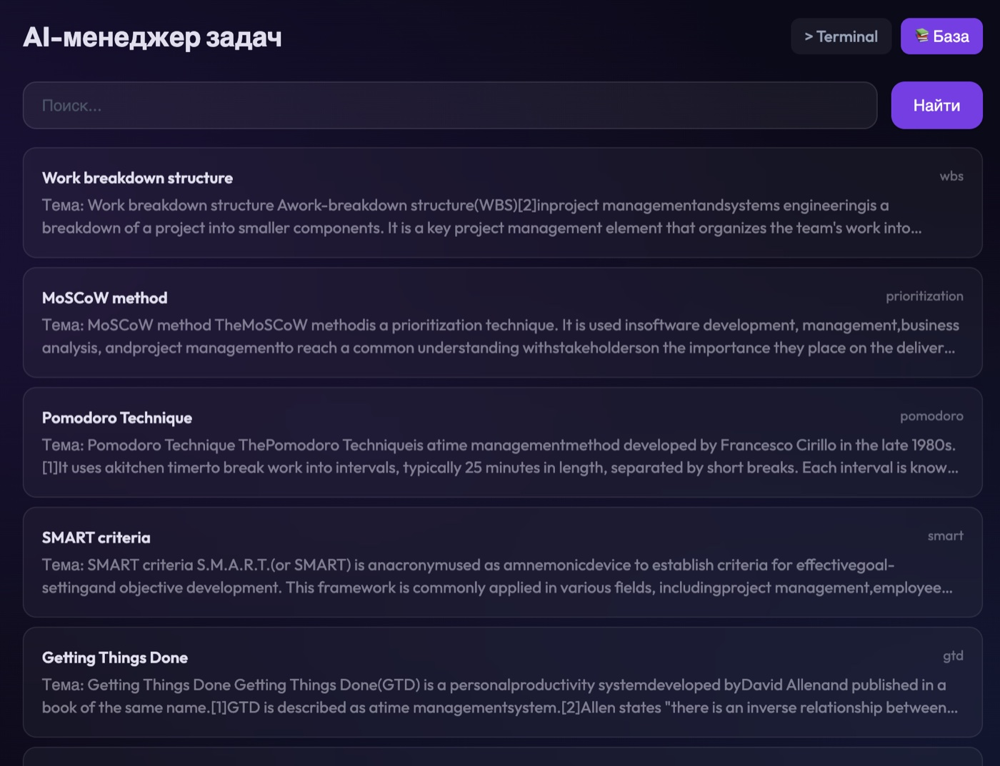
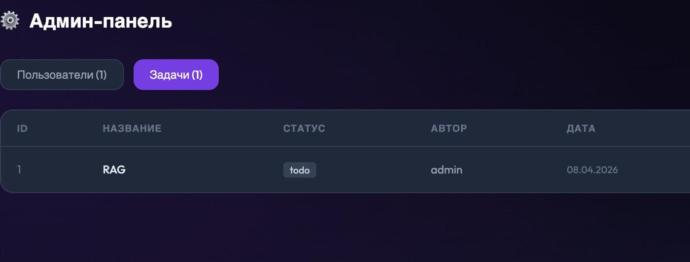
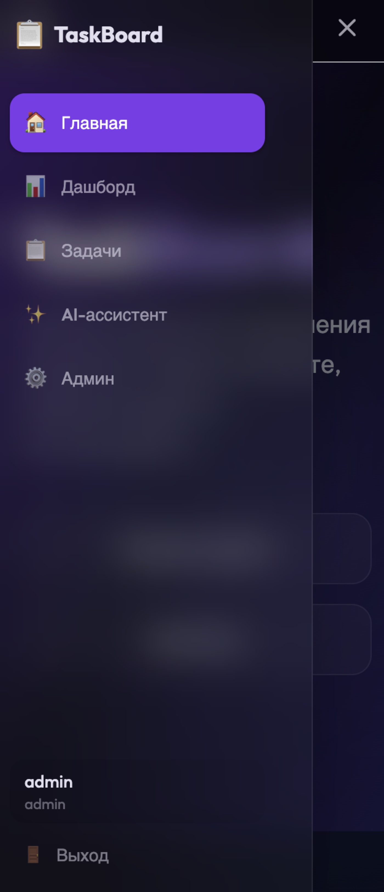

# TaskBoard

Канбан-доска для управления задачами

## Архитектура

```
React 18 (Vite + Tailwind)
    ↕ REST API (JSON)
Django 5 (DRF + SimpleJWT)
    ↕ ORM
SQLite
    ↕
AI Module (OpenAI + RAG)
    ↕
Парсинг Wikipedia — Scrum, Kanban, Agile, GTD (BeautifulSoup)
```

## Backend

- Django 5 + DRF
- Auth: SimpleJWT
- Models: CustomUser, Item (задача), Comment, KnowledgeBase, AIQuery
- Permissions: IsOwner, IsNotBlocked

## Frontend

- React 18, Vite, Tailwind CSS
- React Router v6, Sidebar навигация
- Context API (AuthContext)
- Axios + interceptors

## RAG

```
1. fetch_data() → парсинг Wikipedia (Scrum, Kanban, Agile...)
2. get_embedding(text) → text-embedding-3-small
3. KnowledgeBase.objects.create(embedding=vector)
4. search_knowledge(query) → cosine_similarity → top-3
5. generate_ai_response(prompt, context) → GPT-3.5
```

## Скриншоты

### Главная


### Регистрация и вход

| Регистрация | Вход |
|:-----------:|:----:|
|  |  |

### Канбан-доска


### Задачи

| Создание задачи | Детальная страница |
|:---------------:|:------------------:|
|  |  |

### AI-ассистент (Terminal-стиль)

| Ответ AI | База знаний |
|:--------:|:-----------:|
|  |  |

### Админ-панель


### Мобильная версия


## Запуск

```bash
cd backend && python manage.py runserver
cd frontend && npm run dev
```
