# TimeTracker

> Учёт рабочего времени с таймером и аналитикой

---

### Технологии

`Django 5` `DRF` `React 18` `Vite` `Tailwind CSS` `OpenAI` `SQLite`

### Данные и AI

Парсинг Wikipedia — Pomodoro, Deep Work, Flow (BeautifulSoup)

RAG: text-embedding-3-small → cosine similarity → контекст в GPT-3.5

### Основные возможности

- JWT-авторизация (access + refresh)
- Роли: User / Admin
- CRUD: проект с таймером
- Старт/стоп таймер в один клик
- Почасовые ставки и расчёт заработка
- Дашборд с недельной аналитикой
- AI-чат с RAG (Terminal-стиль)
- База знаний по техникам продуктивности
- Sidebar навигация
- Адаптивный дизайн

### Скриншоты

#### Главная
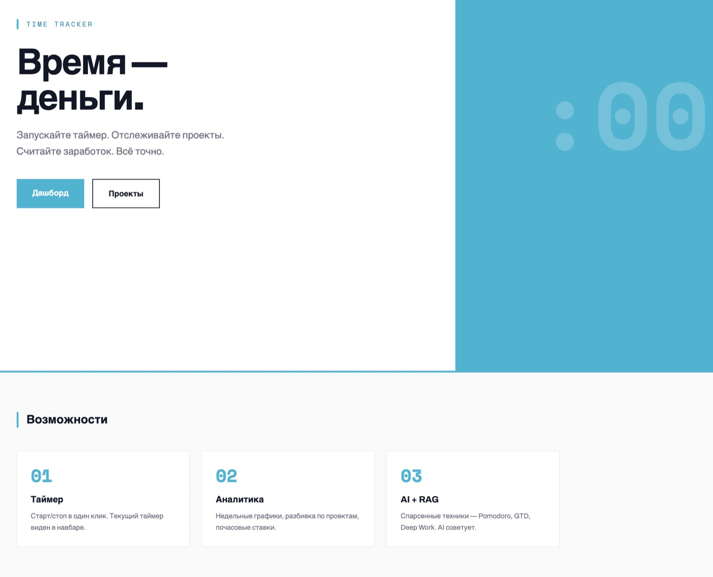

#### Регистрация и вход

| Регистрация | Вход |
|:-----------:|:----:|
| 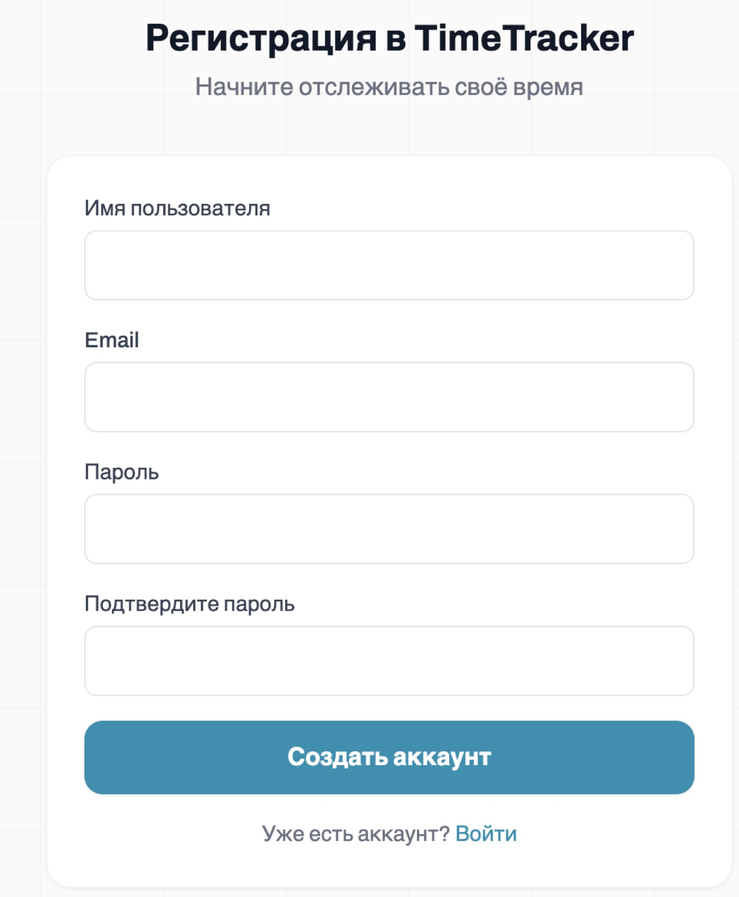 | 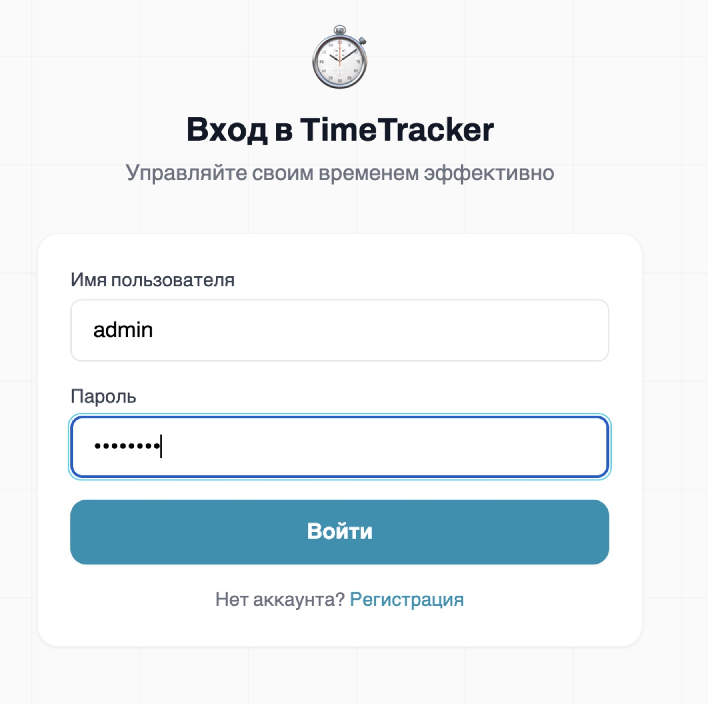 |

#### Дашборд
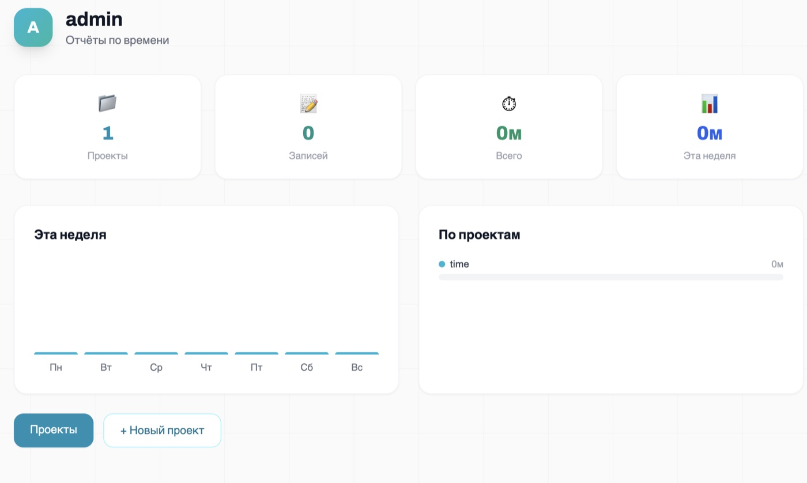

#### Проекты

| Список проектов | Создание проекта |
|:---------------:|:----------------:|
| 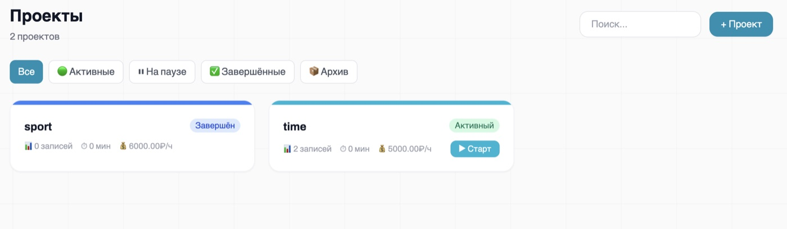 | 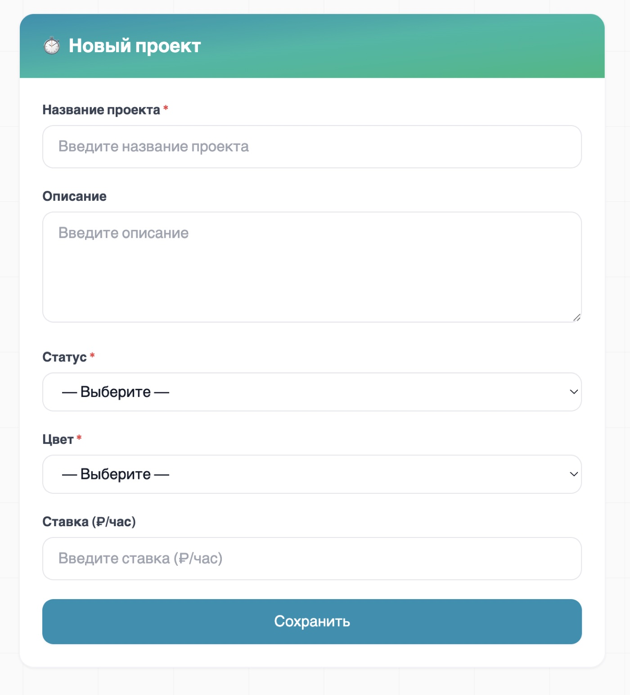 |

#### Детальная страница с записями времени
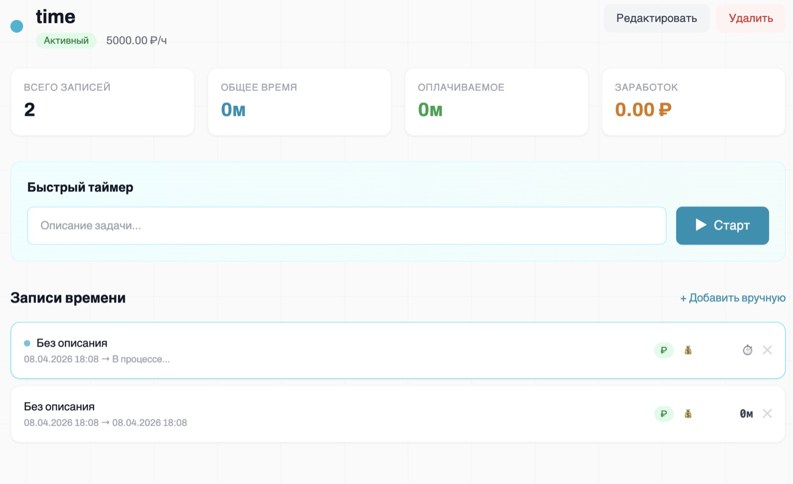

#### AI-ассистент с RAG

| Ответ AI (Terminal) | База знаний |
|:-------------------:|:-----------:|
| 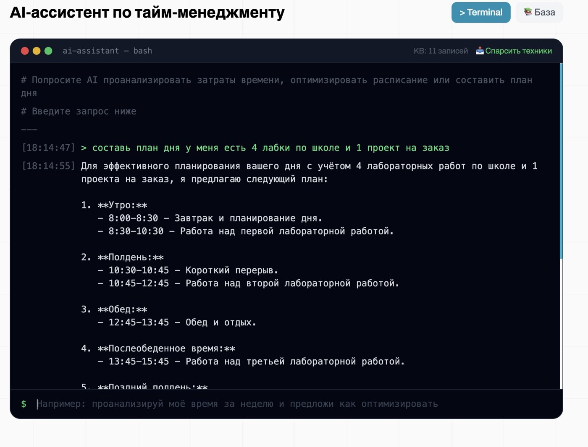 | 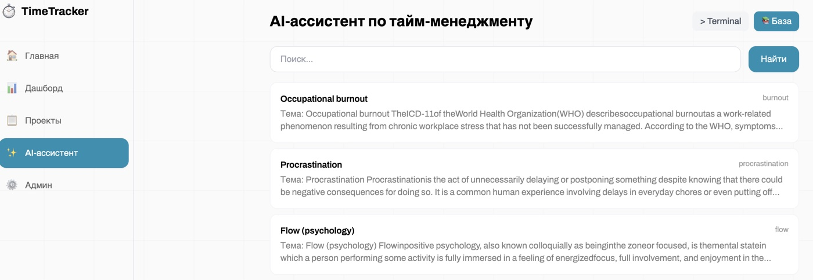 |

#### Админ-панель
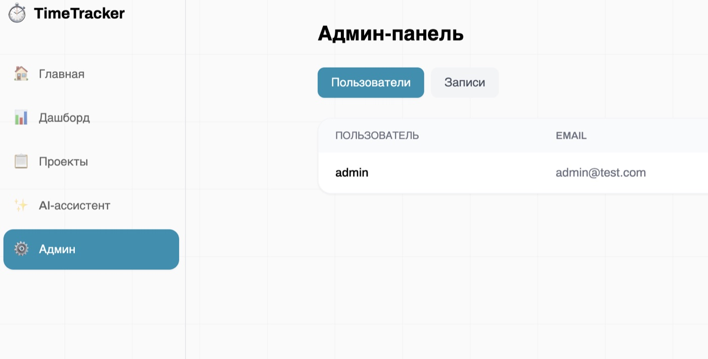

#### Мобильная версия
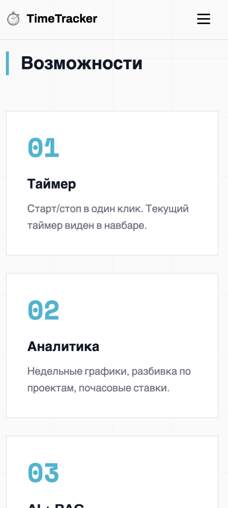

### Запуск

```bash
# Терминал 1: cd backend && python manage.py runserver
# Терминал 2: cd frontend && npm run dev
```
