# YogaFlow — Библиотека йога-практик с последовательностями асан

## Описание

Библиотека йога-практик с последовательностями асан. Полнофункциональное SPA с REST API, AI-модулем и RAG для ответов на основе реальных данных.

## Стек

| Компонент | Технология |
|-----------|------------|
| Backend | Django 5 + DRF |
| Auth | SimpleJWT |
| Frontend | React 18 + Vite + Tailwind |
| AI | OpenAI GPT-3.5 + RAG |
| Embeddings | text-embedding-3-small |
| Данные | Парсинг Wikipedia — асаны, Хатха, Виньяса (BeautifulSoup) |

## Возможности

- Регистрация / авторизация (JWT)
- Роли: User, Admin
- CRUD для сущности: последовательность
- Режим практики с таймером
- Дашборд со статистикой
- AI-ассистент с RAG (поиск по embeddings → контекст → ответ)
- База знаний (загрузка, поиск, просмотр)
- Админ-панель (пользователи, модерация)
- Адаптивный дизайн

## Скриншоты

### Главная
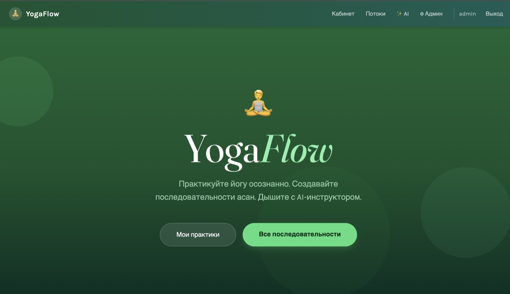

### Регистрация и вход

| Регистрация | Вход |
|:-----------:|:----:|
| 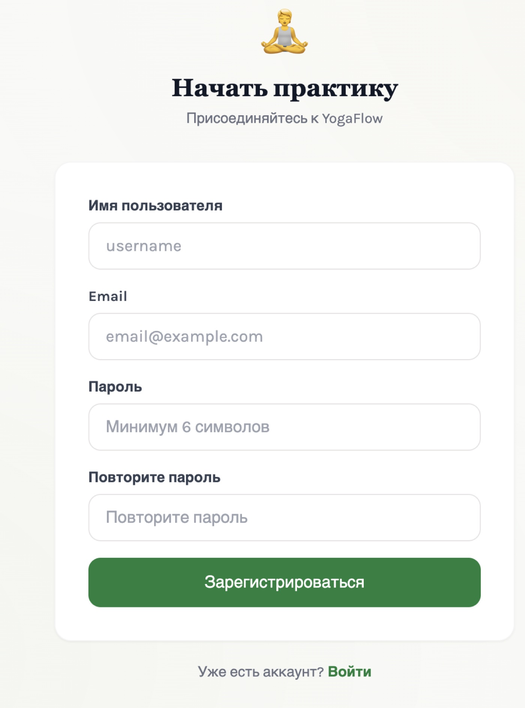 | 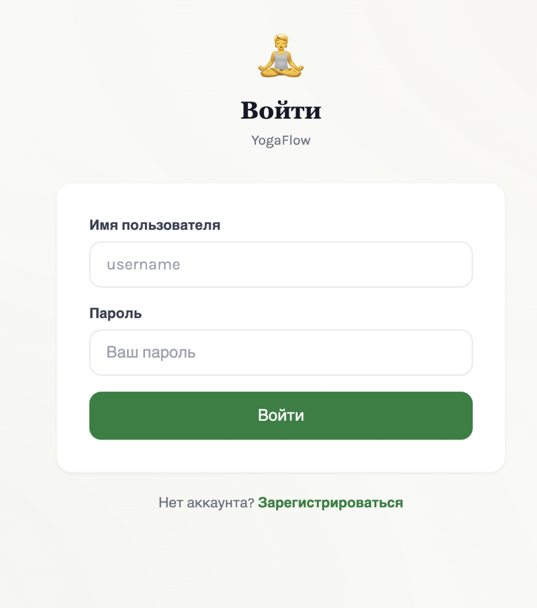 |

### Дашборд
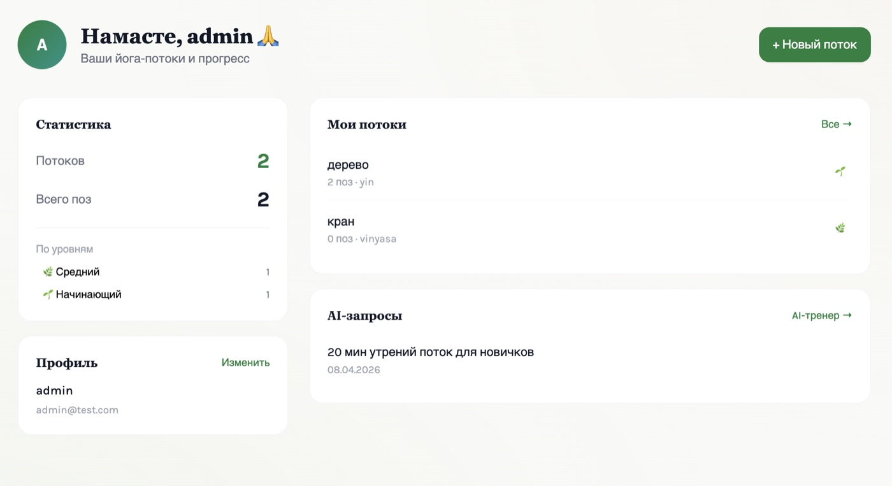

### Последовательности

| Список | Создание |
|:------:|:--------:|
| 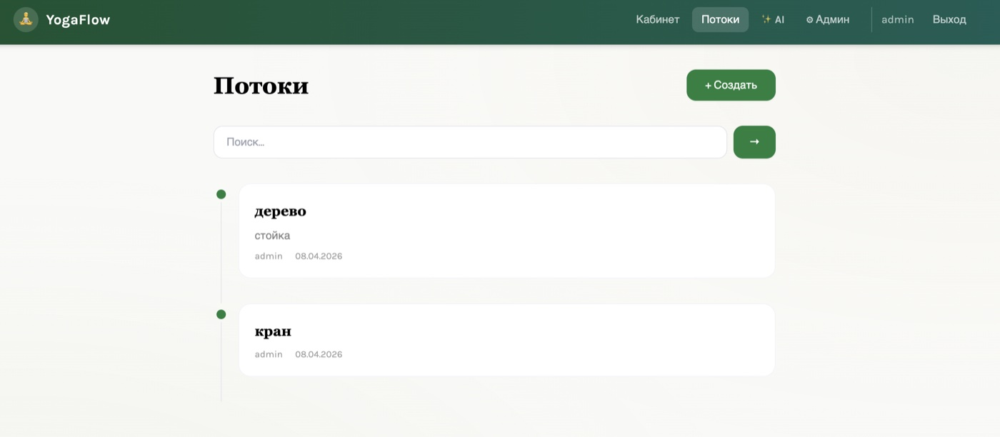 | 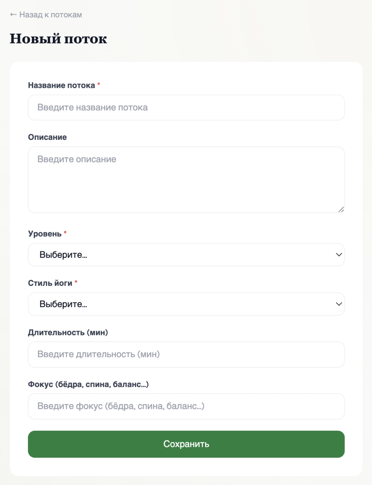 |

### Детальная страница
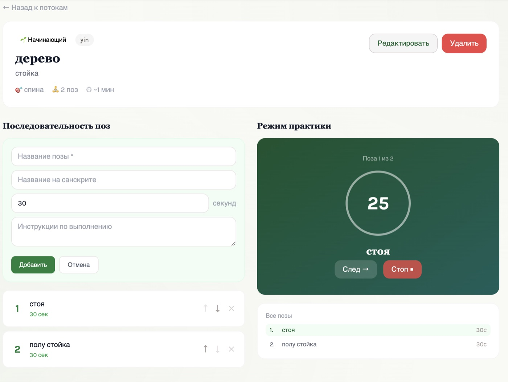

### AI-ассистент с RAG

| Ответ AI | База знаний |
|:--------:|:-----------:|
| 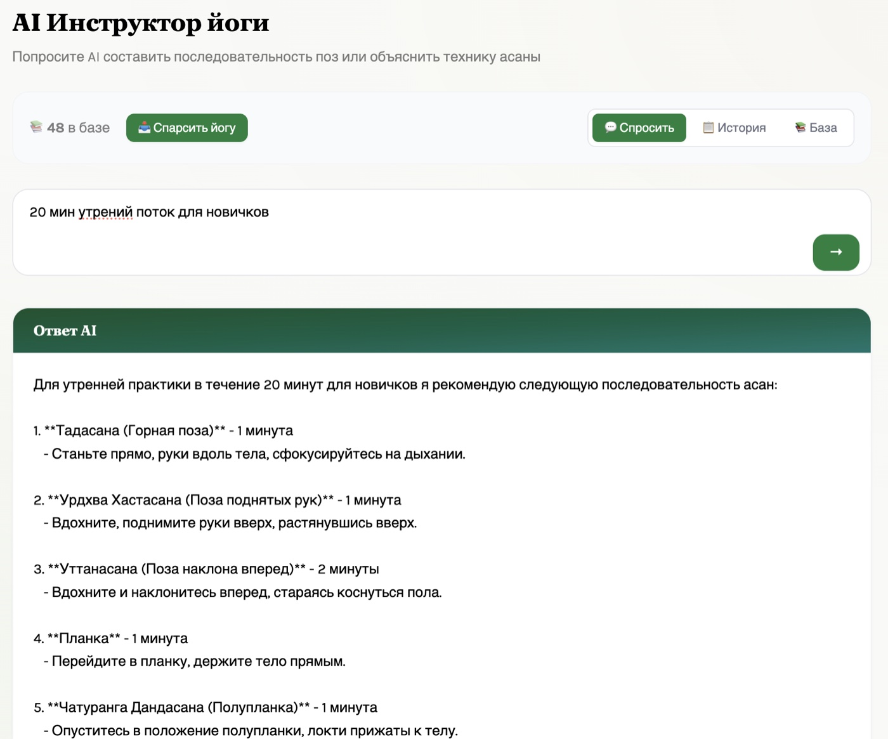 | 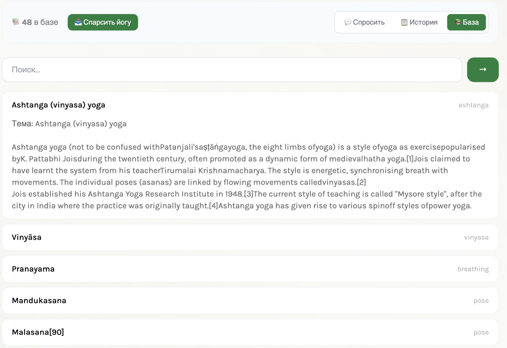 |

### Админ-панель
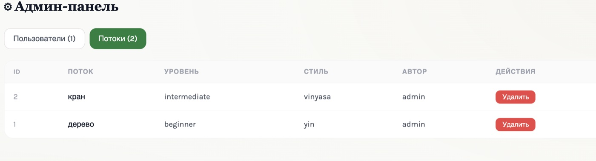

### Мобильная версия
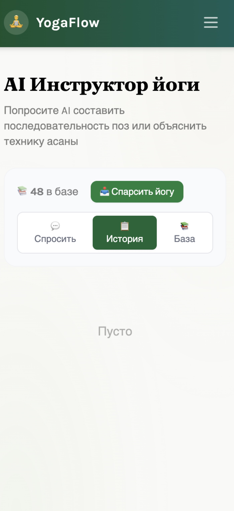

## Запуск

```bash
cd backend && python manage.py runserver  # API
cd frontend && npm run dev                # UI → http://localhost:5173
```
